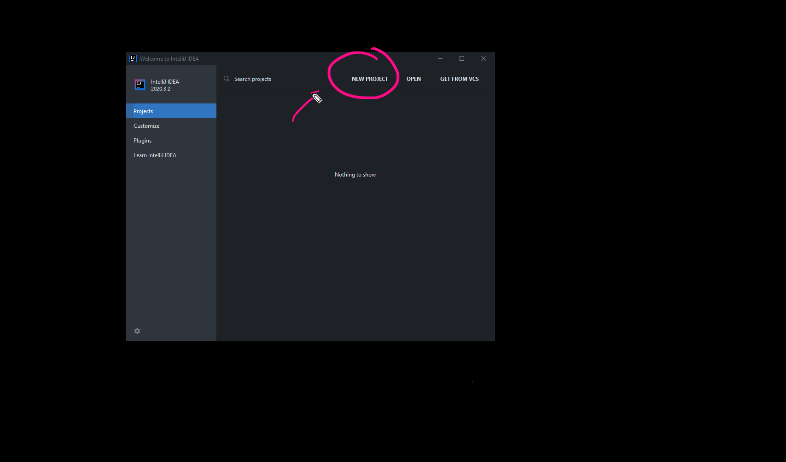
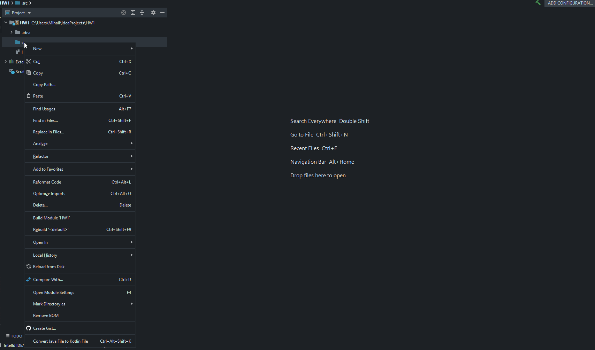

# Решение - Програмистко царство 

Създаваме нов проект с название, което най-коректно ще отразява, идеята на заданието. 



Създаваме си нов клас, който ще кръстим с възможно най-ненатрапчивото наименование **Application**. Не забравяйте да спазвате правилата на Java. Всички класове се пишат задължително с главна буква. 

```java

public class Application {

}
```

Без да се бавим си създаваме познатата ни от C++ main функция, която в Java наричаме **метод**. Той идва при нас с набор от много нови и непознати думички, които разбира се на този етап ще изписваме по интуиция.

```java
public class Application {
    public static void main(String[] args) {

    }
}
```

След като тази операция е завършена, в любимото ни IDE трябва да видим, характерния за тази операция зелен триъгълник, който ще ни насочи към пътя на успеха. 




Време е да стартираме същинското решение на задачата, стъпка по стъпка. 

### **Задача 1** 
Изисква от нас да изведем обикновенно съобщение в конзолата. Ще използваме функцията **System.out.println** като ще подадем директно между отваряща и затваряща малка скоба текста на събощението, *Мазе бот v1 на вашите услуги*. Не забравяйте че съществуват два варианта да изведете съобщение на конзолата :
- System.out.println
- System.out.print

разликата между тях е в допълнителния празен ред, който **println** добавя след извеждане на съобщението. 

```java
System.out.println("Мазе бот v1 на вашите услуги");
```

Не забравяйте, че всяка една команда във вашата програма трябва да завършва с точка и запетая **;**. 

Нека видим как изглежда приложението ни до момента. 

```java
public class Application {

    public static void main(String[] args) {

        // Задача 1
        System.out.println("Мазе бот v1 на вашите услуги");
    }
}
```

### **Задача 2**

Предполага създаване на серия от променливи за съхранение на данни свързани с: 
- нашето първо име
- нашето второ име
- факултетен номер
- възраст

Трябва да съобразим две съществени обстоятелства:
- какъв е типът на данните
- как да кръстим променливите си

Нека разгледаме всяка една от тях:
Променлива за съхранение на първо име - тук нещата са лесни. Имената са просто текст, значи ще ползваме типът **String**. 
 
Що се отнася до идентификатора на променливата, той трябва да е достатъчно разбираем, така че да ни подсказва (като програмисти), какво се съдържа в тази променлива. 
```java
String firstName;
```
Понякога е добре да бъдем екстремно детайлни в начина, по който указваме типът данни и неговата принадлежност. Затова ще си позволя да кажа изрично, че ще пазим първото име на потребителя на системата. 

```java
String userFirstName;
```
На променлива от тип String можем да присвоим директно **низов литерал**. Аз ще напиша моето име - вие вашето. 

```java
String userFirstName    = "Mihail";
```

Нека да повторим процедурата и за второто име

```java
String userLastName    = "Petrov";
```

Може би си мислите, че номера бидейки числова стойност, може да бъде съхранен в променлива от тип **int** или **double**. Въпреки че има логика, идентификаторите от тип номер, често: 
- нямат изрична математическа стойност;
- няма да участват в никакви аритметични операции;
- имат твърде голяма дължина;
- започват с нетипични символи като водещи 0-ли например.

Затова можем спокойно да си позволим да ги съхраним в променлива от тип String. Припомням си студентския ми номер от преди години, а вие добавете вашия, като **низов литерал**.

```java
String userUniqueId    = "1101261005";
```

Възрастта е лесна работа. Обикновенно казвате че сте на 18 / 19 / 20 години, не специфицирате месеците, седмиците, дните или друга подобна стойност. Избираме цяло число като основен тип и срам не срам **присвояваме** **целочислен литерал**

```java
int userAge = 29;
```

Нека видим как изглежда приложението ни до момента.


```java

public class Application {

    public static void main(String[] args) {

        // Задача 1
        System.out.println("Мазе бот v1 на вашите услуги");        

        // Задача 2
        String userFirstName    = "Mihail";
        String userLastName     = "Petrov";
        String userUniqueId     = "1101261005";
        int userAge             = 29;
    }
}

```

### **Задача 3**
Комбинира работата с функционалността за извеждане на текст чрез конзолата и променливите, които създадохме до момента. 
Вече знаем, за магическата сила на оператора **+** стратегически позициониран в компанията на низове. Наричаме тази операция **контакениране**. 

Ще **конкатенираме** низът **Добре дошъл** и променливите, които пазят първото и второто ни име.

```java
System.out.println("Добре дошъл " + userFirstName + " " + userLastName);
```
Обърнете внимание на празните интервали, които оставяме между думичките. Оператора + само и единствено **долепя**, не оставя изрично празно пространство.

По същия начин извеждаме и второто съобщение, съдържащо нашия факултетен номер. 

```java
System.out.println("Ти се идентифицира с номер " + userUniqueId);
```

Без значение дали долепяме низове или числа, резултата от операцията е идентичен, когато в нея участва поне един **низ**.

```java
System.out.println("Ти си на  " + userAge + " години");
```

Нека видим как изглежда приложението ни до момента.


```java

public class Application {

    public static void main(String[] args) {

        // Задача 1
        System.out.println("Мазе бот v1 на вашите услуги");        

        // Задача 2
        String userFirstName    = "Mihail";
        String userLastName     = "Petrov";
        String userUniqueId     = "1101261005";
        int userAge             = 29;

        // Задача 3
        System.out.println("Добре дошъл " + userFirstName + " " + userLastName);
        System.out.println("Ти се идентифицира с номер " + userUniqueId);
        System.out.println("Ти си на  " + userAge + " години");        
    }
}

```

### **Задача 4** / **Задача 5** / **Задача 6** 
Следващите три задачи имат за цел да поупражним писането на променливи и идентификатори за три обстоятелства:
- наименование на продукти
- брой продукти
- партидни номера на продукти.

Важно е да съобразите, че при измисляне на идентификатори на променливи, трябва да имате предвид следните правила:
- променливата помага на програмиста - името ѝ трябва да е описателно и ясно, да не съдържа съкращения, абривиатури или информация ясна само и единствено за нейния съставител
- идентификатора на променливата трябва да насочва потребителя, към типът данни които съдържа. Например ако съдържа брой **count** , ако съдържа название **name**

Всяка една от трите групи променливи, които ще декларираме ще насочват потребителя към:
- название на продукт
- количество
- сериен номер

Поради тази причина, всяка една от тях ще съдържа в идентификатора си следните ключови думи:
- title
- count
- amount
- serialNumber

Моите предложения за имена на променливи са както следва :

за имената на продуктите

```java
String appleWineProductTitle        = "ябълково вино";
String smokedMeatProductTitle       = "пушено месо";
String plumJamProductTitle          = "сливов мармалад";
String marinatedPepperProductTitle  = "мариновани чушки";
String piggyBankProductTitle        = "прасенце касичка";
```

за количеството продукти

```java
int wineProductCount       = 10;
int meatProductCount       = 5;
int jamProductCount        = 9;
int pepperProductCount     = 4;
double bankProductAmount   = 184.35;
```

за сериините номера
```java
String wineSerialNumber     = "C7544_" + wineProductCount;
String meatSerialNumber     = "M7441_" + meatProductCount;
String jamSerialNumber      = "S6491_" + jamProductCount;
String pepperSerialNumber   = "P7485_" + pepperProductCount;
String bankSerialNumber     = "B6584_" + bankProductAmount;
```

Писането на качествени идентификатори е до голяма степен въпрос на опит и интуиция, която се люшка между първото оливане и бруталното съкращение. Ще експериментираме и ще получим положителен резултат. 

Нека видим как изглежда приложението ни до момента.

```java

public class Application {

    public static void main(String[] args) {

        // Задача 1
        System.out.println("Мазе бот v1 на вашите услуги");        

        // Задача 2
        String userFirstName    = "Mihail";
        String userLastName     = "Petrov";
        String userUniqueId     = "1101261005";
        int userAge             = 29;

        // Задача 3
        System.out.println("Добре дошъл " + userFirstName + " " + userLastName);
        System.out.println("Ти се идентифицира с номер " + userUniqueId);
        System.out.println("Ти си на  " + userAge + " години");        

        // Задача 4
        String appleWineProductTitle        = "ябълково вино";
        String smokedMeatProductTitle       = "пушено месо";
        String plumJamProductTitle          = "сливов мармалад";
        String marinatedPepperProductTitle  = "мариновани чушки";
        String piggyBankProductTitle        = "прасенце касичка";

        // Задача 5
        int wineProductCount       = 10;
        int meatProductCount       = 5;
        int jamProductCount        = 9;
        int pepperProductCount     = 4;
        double bankProductAmount   = 184.35;

        // Задача 6
        String wineSerialNumber     = "C7544_" + wineProductCount;
        String meatSerialNumber     = "M7441_" + meatProductCount;
        String jamSerialNumber      = "S6491_" + jamProductCount;
        String pepperSerialNumber   = "P7485_" + pepperProductCount;
        String bankSerialNumber     = "B6584_" + bankProductAmount;

    }
}

```

### **Задача 7**

Последното ни предизвикателство е свързано с визуализацията на всички продукти до момента. Разполагаме с два подхода:
- употреба само и единствено на **System.out.println()**
- комбинация от **System.out.println()** и **System.out.format()**

Първият вариант вече трябва да ни е до болка познат, затова ще разнообразим малко. Нашата резултатна таблица трябва да съдържа три колонки:
- продукт
- брой
- нов сериен номер

Представяме си че резултата ще изглежда по следния начин
> | продукт | брой | нов сериен номер |

Употребата на формат ни дава възможност да запазим консистентни отстояния между антетката на таблицата (в която ще се съдържат хедърите) и всички редове, съдържащи продукти. 

Ще си **декларираме** нова променлива, в която ще дефинираме три слота за променливи и по интуиция ще дефинираме примерно отстояние за всеки един от тях.
```java
String format    = "|%-20s|%-10s|%-20s|";
```
Всички слотове ще бъдат **низови**, и ще имат отстояние от дясно което условно ще дефинираме като 20 и 10 символа. 
Първия ред, който ще визуализира хедъра на таблицата би изглеждал така

```java
String format    = "|%-20s|%-10s|%-20s|";
System.out.format(format, "продукт", "брой", "нов сериен номер");
```

За да бъде визуално по привлекателна финалната визия на табличката, ще добавя разделител преди и след хедъра. Не забравяйте че **System.out.format** не добавя автоматично нов ред, след като е извикана. Затова е необходимо да си послужим с допълнителен **System.out.println**
```java
String format    = "|%-20s|%-10s|%-20s|";
String separator = "======================================================";
System.out.println(separator);
System.out.format(format, "продукт", "брой", "нов сериен номер");
System.out.println();
System.out.println(separator);
```

Вече имаме декларирани променливи за всяка една от трите колонки. Нека да вземем за пример виното:
- продукт - appleWineProductTitle
- брой - wineProductCount
- нов сериен номер - wineSerialNumber

Резултата за първия ред на табличката изглежда по следния начин

```java
System.out.format(format, appleWineProductTitle, wineProductCount, wineSerialNumber);
System.out.println();
```
Повтаряме операцията за всички следващи продукти и получаваме завършена таблица с всички продукти, в красив и стегнат вид
```java
String format    = "|%-20s|%-10s|%-20s|";
String separator = "======================================================";
System.out.println("Отчет за продуктите в мазето");
System.out.println(separator);
System.out.format(format, "продукт", "брой", "нов сериен номер");
System.out.println();
System.out.println(separator);
System.out.format(format, appleWineProductTitle, wineProductCount, wineSerialNumber);
System.out.println();
System.out.format(format, smokedMeatProductTitle, meatProductCount, meatSerialNumber);
System.out.println();
System.out.format(format, plumJamProductTitle, jamProductCount, jamSerialNumber);
System.out.println();
System.out.format(format, marinatedPepperProductTitle, pepperProductCount, pepperSerialNumber);
System.out.println();
System.out.format(format, piggyBankProductTitle, bankProductAmount, bankSerialNumber);
System.out.println();
System.out.println(separator);
```

Не трябва да забравяме че преди да визуализираме таблицата е необходимо да добавим и допълнително съобщение, **Отчет за продуктите в мазето**, но вече сте напълно наясно как да процедирате с тази операция. 


Нека видим как изглежда завършеното ни приложение. 

```java

public class Application {

    public static void main(String[] args) {

        // Задача 1
        System.out.println("Мазе бот v1 на вашите услуги");        

        // Задача 2
        String userFirstName    = "Mihail";
        String userLastName     = "Petrov";
        String userUniqueId     = "1101261005";
        int userAge             = 29;

        // Задача 3
        System.out.println("Добре дошъл " + userFirstName + " " + userLastName);
        System.out.println("Ти се идентифицира с номер " + userUniqueId);
        System.out.println("Ти си на  " + userAge + " години");        

        // Задача 4
        String appleWineProductTitle        = "ябълково вино";
        String smokedMeatProductTitle       = "пушено месо";
        String plumJamProductTitle          = "сливов мармалад";
        String marinatedPepperProductTitle  = "мариновани чушки";
        String piggyBankProductTitle        = "прасенце касичка";

        // Задача 5
        int wineProductCount       = 10;
        int meatProductCount       = 5;
        int jamProductCount        = 9;
        int pepperProductCount     = 4;
        double bankProductAmount   = 184.35;

        // Задача 6
        String wineSerialNumber     = "C7544_" + wineProductCount;
        String meatSerialNumber     = "M7441_" + meatProductCount;
        String jamSerialNumber      = "S6491_" + jamProductCount;
        String pepperSerialNumber   = "P7485_" + pepperProductCount;
        String bankSerialNumber     = "B6584_" + bankProductAmount;

        // Задача 7
        String format    = "|%-20s|%-10s|%-20s|";
        String separator = "======================================================";
        System.out.println("Отчет за продуктите в мазето");
        System.out.println(separator);
        System.out.format(format, "продукт", "брой", "нов сериен номер");
        System.out.println();
        System.out.println(separator);
        System.out.format(format, appleWineProductTitle, wineProductCount, wineSerialNumber);
        System.out.println();
        System.out.format(format, smokedMeatProductTitle, meatProductCount, meatSerialNumber);
        System.out.println();
        System.out.format(format, plumJamProductTitle, jamProductCount, jamSerialNumber);
        System.out.println();
        System.out.format(format, marinatedPepperProductTitle, pepperProductCount, pepperSerialNumber);
        System.out.println();
        System.out.format(format, piggyBankProductTitle, bankProductAmount, bankSerialNumber);
        System.out.println();
        System.out.println(separator);
    }
}

```

С това нашата първа задача е решена. 
