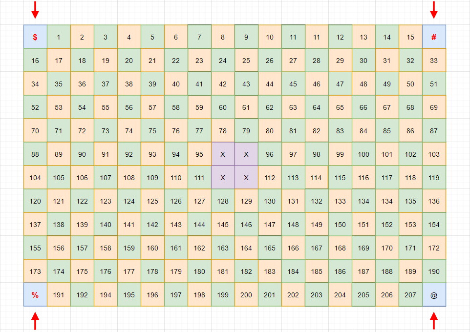
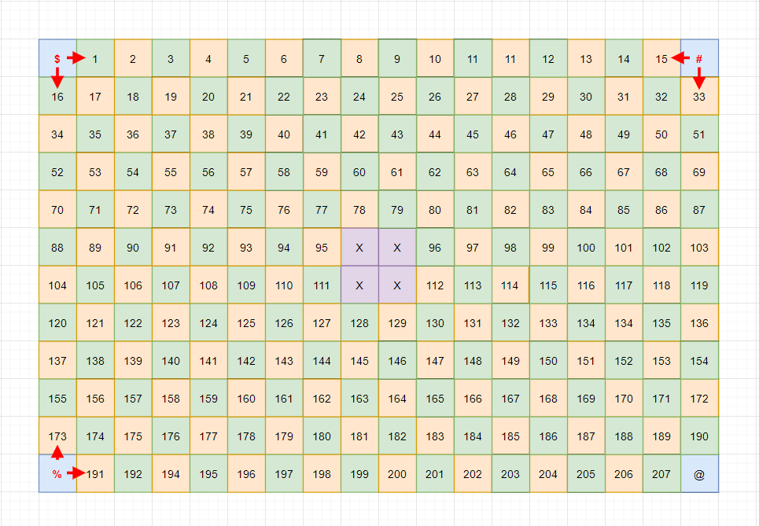
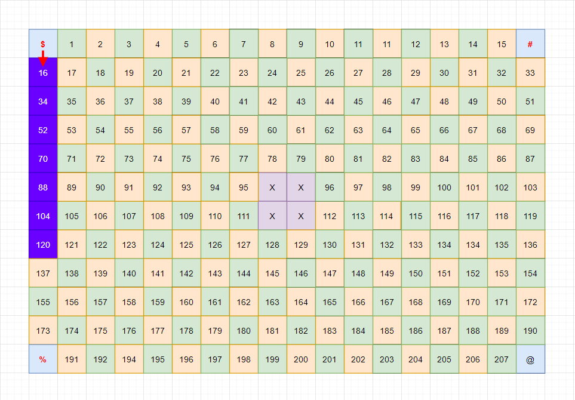
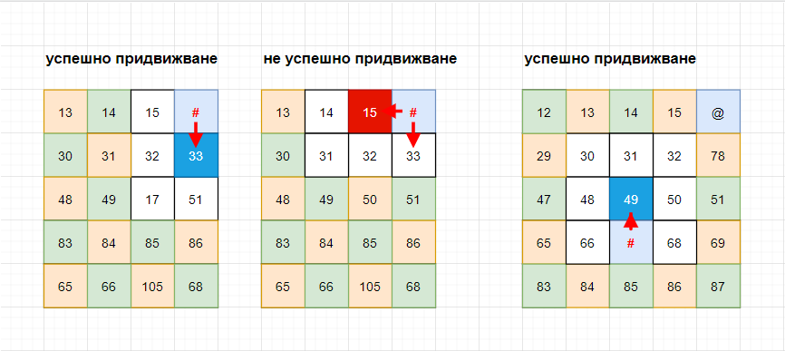
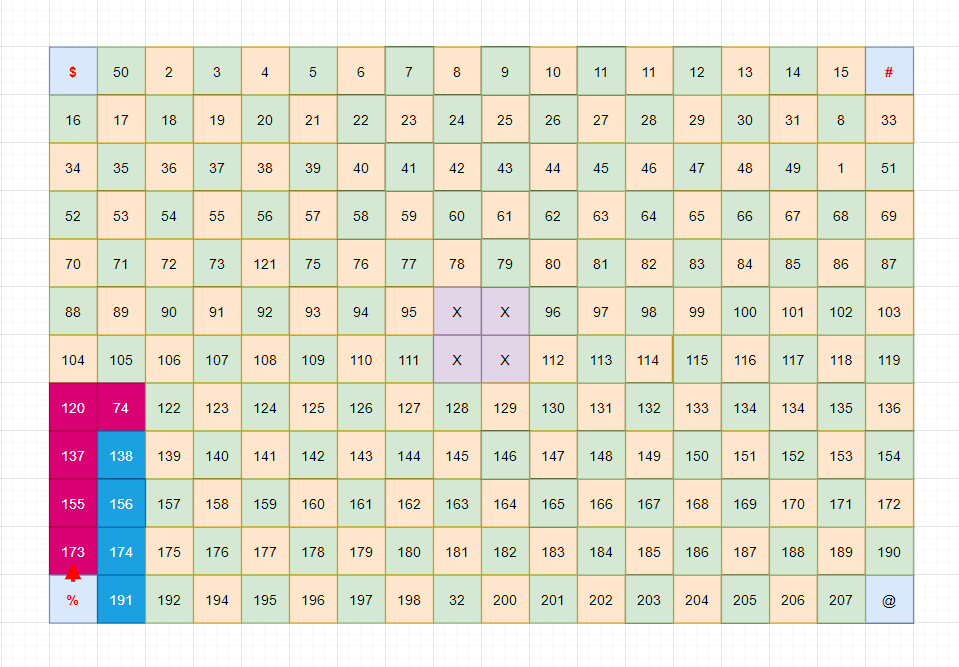
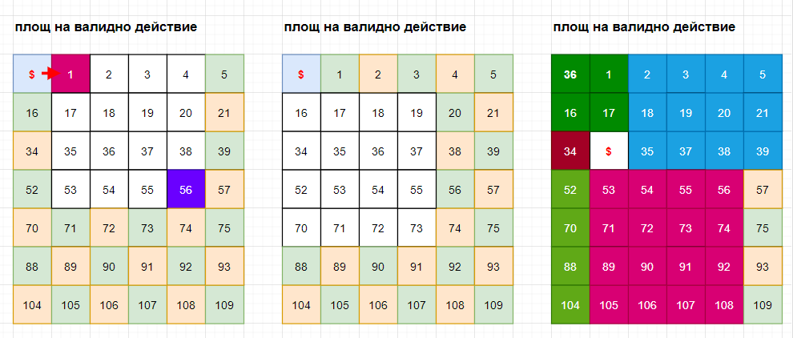
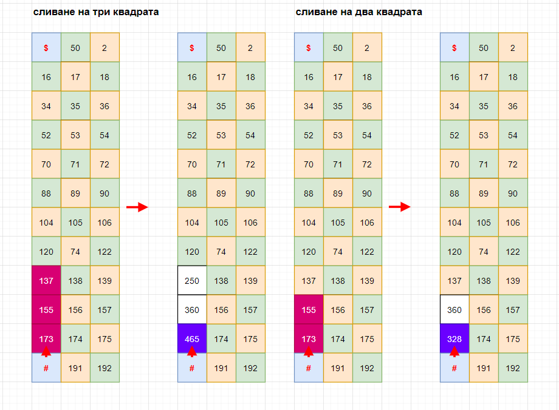
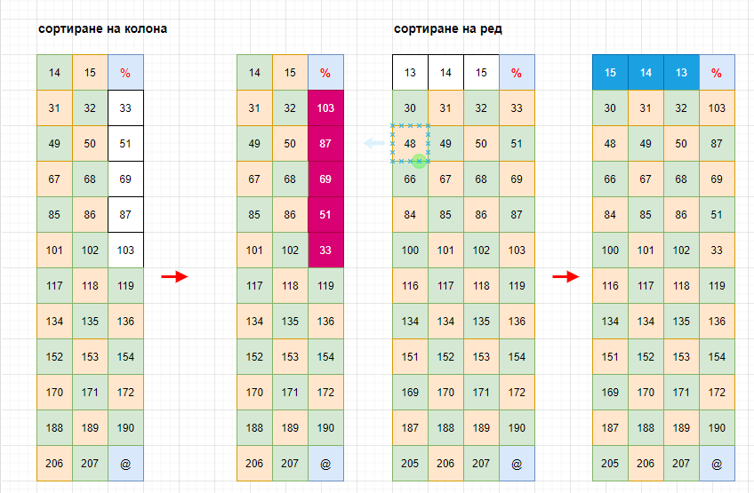
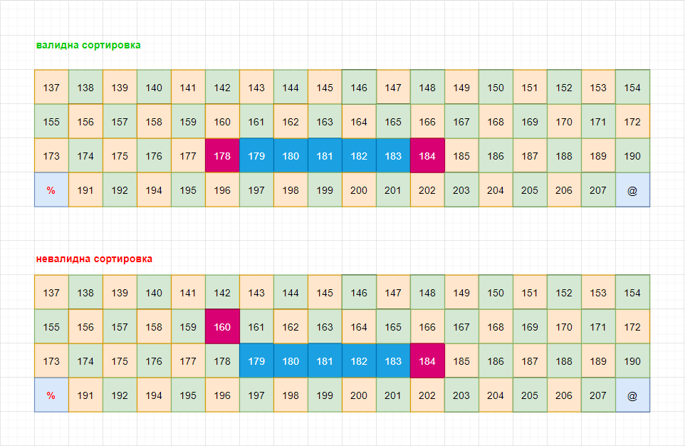

**самостоятелна работа -- седмица 6**

Безработните джуджета от прегорялата планина

## Въведение в упражнението

Любов алчност и чиста лудост, това са съставките на трагедията наречена
Прегорялата планина, събитие разтресло устоите на демокрацията, в
кралството на мнимите джуджета. Легендата разказва че тогавашния
концесионер на плантацията за добив на сватбени украшения, разбрал че
възлюбената му съпруга предпочита да гали брадата на друг. Срамът бил
толкова голям, че от злоба и временна невменяемост той уволнил всички
високообразовани инженери от нощната смяна, примамил благоверната си
съпруга Уруспия, с обещания за чай и сладки в канцеларията на завода и
без да се замисли намалил бюджета за забавления и тихи игри с 1/16.

В момента в който възлюбената му, доня Уруспия прекрачила прага на
прашния кабинет, до ушите и достигал скърцащият звук от стари катинари и
резета. Бедната женица се озовала в прегръдките на веригите пленена от
собственият си емоционално нестабилен съпруг. Семейното законодателство
на царството, не било достатъчно развито за да е произнесе по въпросите
на междуличностните конфронтация в брачната идилия, и верни на принципа
не си ври големия нос където не ти е работата, оставяли глухи за
семейното насилие и случаите на домашен терор. Но там където
нормативните устави остават безсилни истинската любов изпепелява, със
своята сила.

Влюбения Гном Отело, бил въглищар в долните нива на перспективното
предприятие. В късните часове на работната му смята, притеснен от
липсата на романтични SMS с ясно подчертан еротичен характер от неговата
любовница, той усетил смущение в силата и активирал чакрите на своята
емоционалност. Злите езици шушукали без свян, че Отело и Уруспия от години
въртят незаконна любов, под големия нос на началника, но понеже негова
милост не вижда по далеч от него, буквално останал глух и сляп за
тези слухове. Понесен на крилата на съмнението, Влюбения Гном Отело,
тръгнал към кабинета на своя началник, с планове за отвличане и телесна
конфронтация, включваща отнемане на кислорода.

В този момент попарени от новината за своето уволнение безработните
високо образовани джуджета, основали синдикат по бързата процедура и
тръгнали към канцеларията на висшия мениджмънт да настояват, за
компенсации и справедливост.

В същия миг, на другия край на предприятието пияния фокусник Шмандалф,
въоръжен с хонорарен лист в ръка, тръгнал да прибира вземанията си.
Последните три месеца той правил, фокуси на вересия, хранен с обещания
за постоянно работно място и 300 мили литрови патрончета, женски ликьор.

Усетил заплахата която се приближавала към него г-н. Главан, решил да
сложи край на мъките и срама си, като вземе със себе си всички, осмелили
се да предадат доверието му. Безпощадния огромен червен бутон за
самоунищожение бил внимателно натиснат и обратното броене започнало. 15
минути до края на тази трагична приказка. Как ще завърши зависи само от
вас.

## СПЕЦИФИКАЦИЯ

Напрежението може да се реже с нож, разполагате с 15 минути да спасите
Уруспия, да си върнете достойнството и да кеширате хонорарните си
листове за последните три месеца. Хайде да действаме.

Прегорялата планина, може да се представи като правоъгълна решетка с
размери \[**18 X 12\]**. Сондирането на скъпоценни камъни през годините
предположи създаването на редица коридори, мостчета и пътечки в недрата
на природното творение. Понеже шефа мина тънко, всяка една пътечка беше
изградена със съмнителни материали, закупени с безотчетни средства от
неизвестни дистрибутори, в неназовани пазари за строителни материали.

Всяка клетка от решетката представлява, платформа на която можем да
стъпим за да стигнем от точка А до точка B. (за целите на задачата си
представете че това са мостове и коридори през които се преминава)

Всяка една клетка има номерче, **което е уникално и не се повтаря** в
рамките на цялата решетка. Номерчето съответства на качеството на
материала, от който е изградена платформата. **Номерата върху
платформата се генерират и позиционират на случаен принцип при
стартиране на ново** приключение

Разполагате с тримата герои в нашата епична история :

  ----------------------------- -------------------- ---------------------
  **герой**                     **съкращение**       **символ**

  Влюбения Гном Отело           **ВГО**              **\#**

  Синдиката на безработните     **СБД**              **\$**
  джуджета                                           

  Лилавния фокусник Шмандалф    **ЛФШ**              **%**
  ----------------------------- -------------------- ---------------------

| **герой**                             | **съкращение**  | **символ**  |
|---                                    |------------     | ---------   |
| **Влюбения Гном Отело**               | **ВГО**         | **\#**      |
| **Синдиката на безработните джуджета**| **СБД**         | **\$**      |
| **Лилавния фокусник Шмандалф**        | **ЛФШ**         | **%**       |

(***Съкращенията се ползват, само в рамките на описанията в спецификацията и нямат стойност за крайната програма***)

Те независимо един от друг искат да достигнат до офиса на шефа, но
водени от инстинкт за самосъхранение прибягват към колаборативни
действия за благото на успеха.

### Позициониране на обекти върху картата

Параметрите на картата могат да бъдат дефинирани по следния строг но
справедлив начин.

На координати **\[5 -- 8\]** / **\[5 - 9\]** / **\[6-8\]** / **\[6-9\]**
е позициониран офиса на началника, отбелязан със символ \[X\]

В четирите ъгъла на картата имаме работни зони, където са позиционирани
нашите герои. Позиционирането на героите винаги се случва в празните
зони, на случаен принцип, като една от четирите винаги остава празна,
запълнена със символ **\[@\]**

## Правила за придвижване

Всеки един от героите може да се придвижва само по определени платформи,
за да не стане жертва на обстоятелствата.

В началото на приключението, всеки един от героите е позициониран на
случаен принцип в един от четирите ъгъла на планината. От тази позиция
може да направи избор за следващата платформа към която да се придвижи.

### придвижване - СИНДИКАТА НА БЕЗРАБОТНИТЕ ДЖУДЖЕТА

СБД може да се придвижва само върху платформи изградени от материал с
прогресивно нарастващи четни стойности. Тоест всяко следващо движение
трябва да се подчинява на това правило.

На примерната схема е възможно да се извърши действие само върху
отбелязаните с лилаво квадрати. Тоест първи ход трябва да е задължително
върху клетка **\[16\]**, от там на сетне валидни движения могат да се
извършат само върху останалите лилави квадрати.

Всички останали квадрати са не четни, затова не могат да бъдат ползвани
за придвижване, на този герой

### придвижване - ВЛЮБЕНИЯ ГНОМ ОТЕЛО

ВГО може да се придвижва само върху квадратчета чиято стойност е
по-голяма от средното аритметично на всички техни съседни платформи,
включително и платформата към която искаме да се придвижим (съседни
наричаме платформите, които се намират непосредствено до квадратчето,
към което искаме да се придвижим)

Внимание позицията на героя не се включва в изчисленията на средно
аритметичната стойност.

Нека разгледаме примерите:

-   Правим опит да се придвижим до **платформа 33 от ъглова платформа.**
    В този случай с бяло са изобразени платформите участващи в
    изчисленията. **(15+32+17+51+33) / 5 29\
    **Стойността е по-малка от стойността на платформа 33, придвижването
    е успешно

-   Правим опит да се придвижим до **платформа 33 от ъглова платформа. В
    този случай с бяло са изобразени платформите участващи в
    изчисленията. (15+14+31+32+33) / 5 38\
    Стойността е по-голяма от стойността на платформа 15, придвижването
    е неуспешно.**

### придвижване - ЛИЛАВИЯ ФОКУСНИК ШМАНДАЛФ

ЛФШ може да се предвижва само върху **низходящо сортирани платформи**,
считано от първата платформа която се избере за придвижване.

На примерната схема възможни избори за придвижване са :

-   173 и продължаваме по червените квадрати.
-   191 и продължаваме по сините квадрати

## МагиИИИИИки

Всеки един от героите има възможност да пречупи законите на физиката, и
да промени свойствата на платформите за целите на своето приключение.

### МагиикА НА СИНДИКАТА НА БЕЗРАБОТНИТЕ ДЖУДЖЕТА

Използвайки тайните похвати на ювелирното джуджешко изкуство, малките
търгаши могат лесно да разменят случайни платформи така че да, продължат
приключението си. Разстоянието на което може да се случи този процес е
до 4 квадрата считано от текущата позиция на героя. (по хоризонтал / по
вертикал ) (консултирайте схемата)

Процеса по разместване следва следния прост алгоритъм. Изберете
координатите на квадратчето което искате да размените, след това
изберете координатите на дестинационната позиция.

На фигурите са представени три различни перспективи за валидна площ на
действията по редове и колони. На последната схема можете да забележите
активните области когато героя е позициониран на територия различна от
ъгловите квадрати. Валидната площ винаги образува правоъгълник с
максимален размер на стените до 4 квадратчета.

### МагиикА НА ВЛЮБЕНИЯ ГНОМ ОТЕЛО

Със силата на въглищарските си способности, и двата си ковашки
сертификата, Отело може да слее до три квадратчета в едно. Резултата е
ново квадратче което съдържа сумата между слетите квадрати.

Големия въпрос е какво се случва със слетите такива. Истината е че
тайните сили, на прегорялата планина, материализират на тяхно място нови
стойности, които задължително трябва да са уникални, за цялата
правоъгълна решетка. Случайност, не мисля.

Способността му действа само в рамките на три квадрата считани от
текущата му позиция, по редове и колони. Сливане по диагонали не е
позволено.

{width="6.5in"
height="4.776388888888889in"}

**\
**

### МагиикА НА ЛИЛАВИЯ ФОКУСНИК ШМАНДАЛФ

Фокусника никога не закъснява, нито е рано той винаги е на време. Това е
възможно само ако не прекаляваш с алкохола и имаш способността да
сортираш бележника и календара си така че никога да не омотаваш,
ангажиментите си. Силата на сортировката е в основата на майсторството
на Шмандалф. Той има възможност да сортира геометрично всяко едно
квадратче в прегорялата планина, в права линия по РЕД или КОЛОНА.

Шмандалф може да избере възходящо или низходящо сортиране, в зависимост
от настроението и тъмните си сили. Великия комбинатор няма ограничения в
своите способности,

Напълно възможно е да се активира квадратче което се намира на
произволно място на картата, като се избере начална и крайна координата.
Единственото внимавайте, за правите линии

-   Валиден избор. Числата 178 и 184 са позиционирани в рамките на един
    ред.

-   Невалиден избор Числата 160 и 184 са позиционирани в два различни
    реда

### Ходове

Приключението се осъществява на ходове, като в рамките на всеки ход
имате възможност да направите много действия.

Всеки един от героите може да извърши едно от следните действия.

-   Активиране на магииииика

-   Придвижване

В началото на хода се листват всички единици които могат да извършат
ход, можете да си изберете, една от тях и да извършите само едно от
описаните действия.

След приключване на действие изведете броя на оставащите ходове

**Внимание**, стените на правоъгълната решетка, в която се развива
действието се третират като твърда каменна преграда, не можете да
напускате пределите на помещението при никакви обстоятелства.
Допълнително е важно да се отбележи че периметъра на офиса също се
третира като стена. Ако някой от героите извършва действие, в периметъра
на офиса, то неговите координати се възприемат като край на картата.
Така например Шмандалф не може да сортира числа, в ред или колона
пресичани, от очертанията на офиса.

Използвайте ограниченията мъдро и преценявайте ходовете си разумно.

### Приключване на приключението

**Епичното приключение приключва, при настъпване на едно от следните
обстоятелства :**

Който и да е от героите, достигне успешно до офиса на шефа, успява да
спре унищожението на прегорялата планина и печели универсалното уважение
на всички момичета, признателността на обществото и кой знае какви още
облаги.

Ако след изтичането на **15 хода**, никой не е достигнал до офиса на
шефа, приключението наречено живот приключва, с подходящо съобщение и
силни емоции.

## ЗАДАЧИ ЗА ИМПЛЕМЕНТАЦИЯ

Всяка една от разработените задачи ще се оценява в точкова система с арбитрарни тежести. Максималното количество точки, които можете да получите от решението на поставените ви условия е 300 точки.

Повече информация за предаването на вашите решения можете да намерите в секция **ПРЕДАВАНЕ НА РЕШЕНИЯТА**.

| функционалност                                                | точки  |
|---                                                            |---     |
| **Визуализация на картата, с коректни стойности и параметри** | 25     |
| **Визуализация на героите**                                   | 25     |
| **Имплементация на придвижването на СБД**                     | 35     |
| **Имплементация на придвижването на ВГО**                     | 35     |
| **Имплементация на придвижването на ЛФШ**                     | 35     |
| **Имплементация на магиика на СБД**                           | 35     |
| **Имплементация на магиика на ВГО**                           | 35     |
| **Имплементация на магиика на ЛФШ**                           | 35     |
| **Успешно приключване на мисията**                            | 20     |
| **Неуспешно приключване на мисията**                          | 20     |

## ПРЕДАВАНЕ НА РЕШЕНИЯТА

Задължително е да си направите нов проект в GitLab-а на курса, със заглавие **pu-fmi-java-intro-w6-7-l3**
Ако не можете да го запомните - копирайте го. Ако имате нужда от допълнителна помощ, използвайте инструкцията, в [този документ](../../../submit/README.md)