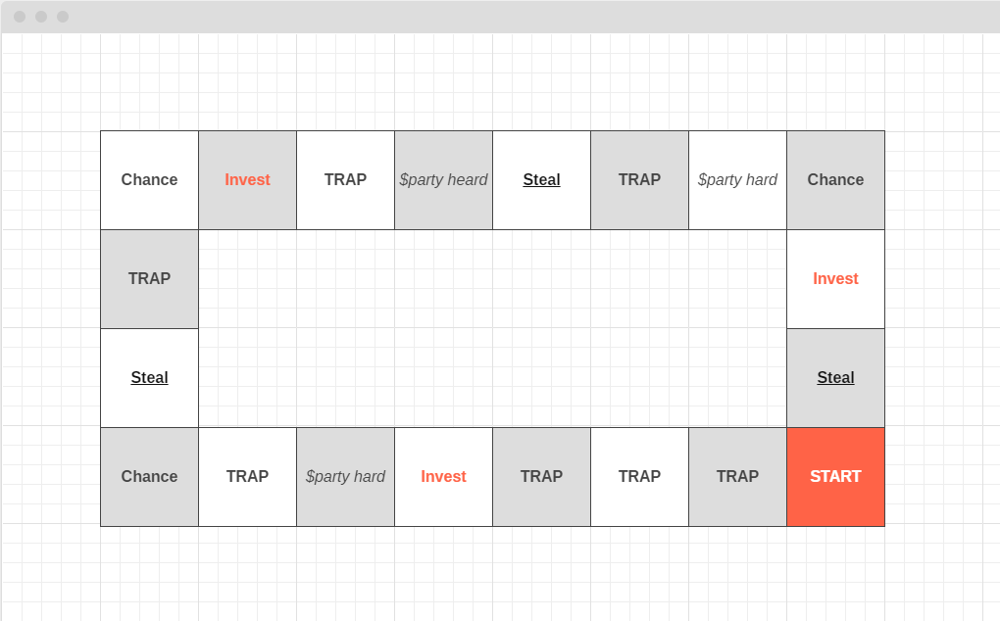

# Малки котки

Извънредни новини, извънредни новини, шоколадовата банка затваря врати. Смут и паника са сковали страната на седемте обединени царства и трите разединени провинции. Икономическите анализи, предвещават криза, а цените на шоколада скачат, главоломно, чудовищата от миризливите планини замислят бунт.

В условията на зараждащата се истерия, кралят на дебелите котки стяга сватба, заплашваща да разклати основите на здравия разум и да даде храна за размисъл на критиците. Избраницата е малката Мацорана, с артистичното име Писана, аристократична котка с добре поддържани лапички, победителка в конкурса за красота „Playcat“, популярно социално събитие на острова.

Династичният брак трябва да се сключи пред погледите на милиони поданици, циментиращо за пореден път устоите на монархията.

Мацорана, обаче, не желае щастието на своя баща, тийнейджърските години са ѝ дали правото да се бунтува, сърцето ѝ принадлежи на друг. Злите езици в империята шушукат за тайни срещи между малката котка и главният изпълнителен директор на организацията на чудовищата и злодеите Гад Мръсен, който е известен със своят изискан вкус към всичко пухкаво.

На фона на всичко, което се случва в страната, акциите на стоковите предприятия се сриват надолу, и май на никой не му пука, защото обществото основно се вълнува от клюки и мръсотия. Борсовите спекуланти са решили да се възползват от нестихващият интерес към жълтините и искат да сринат печалбите на най-голямото предприятие за производство на стрелкички за джобни часовници в страната, сочено от мнозина като основен двигател за икономическият прогрес на империята. Тази активност ви дава идея. В света на парите всички сме затворници на собствената си съвест.

Далновидните хакери са се свързали с вас в опита си да получат допълнителни мозъчни мускули за целите на хакерската атака. Добре извество е, че цялата икономика се управлява от борсов симулатор, в който всеки експерт с малко мозък и много пари може да се пробва да умножи богатството си или да загуби всичко трагично и комично. Помогнете на спец бандата на ОЧЗ да срине доверието в котешката икономика, изпълнете злия план, за който ще се говори години наред. За тази цел трябва да обучим нашите прекрасни малки котки, колаборационисти, да атакуват играта с пухкави лапички и много злоба.

За да се извърши подлото дело е необходимо да се създаде копие на симулатора, по образ и подобие на оригинала. За тази цел е инициализирана специална акция по кражбата на плановете, но за нея ще ви разкажа друг път, че стана мнооооого дълго. Плановете вече са при нас и можем да започваме, така че по същество. Борсовият симулатор страшно много прилича на играта „Монополи“.

## Игрово поле

Играта се играе върху **импровизирана решетка**, всяко едно от квадратчетата в тази решетка показва инвестиционните решения, които вашият виртуален аватар може да предприеме.

В началото на всяко завъртане (цикъл) квадратчетата в играта променят своята позиция, на случаен принцип, като е необходимо единствено да се запази бройката възможности, както следва:

-   **TRAP  - 7 броя**
-   **Invest - 3 броя**
-   **Party hard - 3 броя**
-   **Chance  - 3 броя**
-   **Steal  - 3 броя**

**примерен изход :** 

\|X\|\|X\|\|X\|\|X\|\|X\|\|X\|\|X\|  
\|X\|  &nbsp;&nbsp;&nbsp;&nbsp;&nbsp;&nbsp;&nbsp;&nbsp;&nbsp;&nbsp;&nbsp;&nbsp;&nbsp;&nbsp;&nbsp;&nbsp;&nbsp;                                                    \|X\|  
\|X\|  &nbsp;&nbsp;&nbsp;&nbsp;&nbsp;&nbsp;&nbsp;&nbsp;&nbsp;&nbsp;&nbsp;&nbsp;&nbsp;&nbsp;&nbsp;&nbsp;&nbsp;                                                    \|X\|  
\|X\|\|X\|\|X\|\|X\|\|X\|\|X\|\|S\|

## Правила за придвижване

В рамките на играта се използва понятието „**зар**“. Той се хвърля винаги само и единствено от играта. Играчът не управлява заровете по никакъв начин. Когато в инструкциите прочетете, че дадено действие се извършва с **{N} стенен зар**, това означава че играта генерира случайно число в интервала от 1 до N (включително), за да се вземе решение.

Всяка една игра, се състои от цикли (завъртания по игралното поле), които, от своя страна, се състоят от определено количество ходове. Един цикъл представлява преминаването на играча през всички квадратчета на дъската (**едно завъртане по посока на часовниковата стрелка**).

Един ход се състои от преминаването на играч през едно квадратче. В началото на хода играта хвърля 2-стенен зар, за да придвижи играча определено количество квадратчета, в рамките на дъската. Броенето на квадратчетата започва от мястото, на което играчът е позициониран в момента + N брой на квадратчетата, които се намират пред него.

Всяко едно от квадратчетата си има специално значение. При позициониране на фигура върху квадратче, следва да се изпълни действието описано върху него. Повече информация за квадратчетата и тяхната роля ще откриете в секция „**Игрови квадратчета“. До всяко едно от полетата е означена и буквичката, с която то се визуализира в рамките на игровото поле.**

**Брой играчи**

Играта е уникална и няма ограничение в броя на играчите, които могат да я играят едновременно, но нека да пробваме в началото да я реализираме, така че да има максимално количество **двама играчи**. Искаме, обаче, вторият играч да бъде виртуален и да взима решенията си самостоятелно.

Играете срещу хита на съвременната борсова търговия, полуавтоматичен ъглово-линеен еволюционен неорганичен борсово-организационен теоретик или накратко **ПЪЛЕН БОТ.**

**Играчите играят последователно един след друг.** В началото на играта симулаторът избира, на случаен принцип, кой играч да започне първи. Последователността се запазва **до края на текущия игрови цикъл**. В края на цикъла играчът, който разполага с повече пари започва първи своето придвижване.

## Игрови квадратчета

### Start \|S\|

Това е неутрално квадратче, то има специални правомощия в играта, тук аватарът Ви получава шоколадовите си дажби за текущия си ход. Всеки играч стартира с **1000 шоколадови парички**.

Стъпване върху квадратче **Start** означава, че един игрови цикъл е приключил.

**Trap \|T\|**

Това е квадратче, което дава възможност на играча да заложи капан на своя противник. Капаните са мръсните игрички в нашия занаят и трябва да подхождаме към тях внимателно.

Когато играч попадне върху квадратче „капан“ и противникът ни **НЕ Е заложил капан**, тогава **можем** да се възползваме от възможността **ДА заложим**. Залагането на капан е свързано с инвестиция, тя зависи от типа на капана, който искаме да заложим. Всеки един капан предоставя някакво последствие за играча, които попадне на него. **Възможни са следните пет капана**:**  
**

| **КАПАН**         | **ОПИСАНИЕ**                                                                                                                                       | **НАКАЗАНИЕ**                                                                                                       | **ИНВЕСТИЦИЯ** |
|-------------------|----------------------------------------------------------------------------------------------------------------------------------------------------|---------------------------------------------------------------------------------------------------------------------|----------------|
| Данъчна ревизия   | Анонимен сигнал е насъскал органите на котешката данъчна полиция, морално осакатените ръководители трябва да напуснат страната възможно най-бързо. | Губите 10 процента от всичките си приходи в край на цикъла.                                                         | 10             |
| Развод по котешки | Съпругата на основния акционер е намерила сили да признае, че щастието ѝ е илюзорно. Подала е документи за развод и иска да получи всичко.         | В края на цикъла , играта хвърля 10-стенен зар, ако стойността е 2 или 8, не получава печалба или загуба от цикъла. | 20             |
| Пропаганда        | Започва мащабна кампания, промотираща вредата от консумация на вафли, народът изпада в паника и активно избягва своята икономическа активност.     | Не можете да поставяте повече капани в рамките на текущия цикъл.                                                    | 100            |
| Проглеждане       | Моралът в бизнеса скача, изпълнителният директор на компанията търси доброто в хората и отказва да участва в мръсни игрички.                       | При попадане, на квадратче **Steel** играчът губи право да реализира зъл план.                                      | 50             |
| Хазартен бос      | Главният счетоводител е намерил утеха в ротативките и активно консумира пенсионните фондове на служителите за финансиране на злите си дела.        | Следващото квадратче **Шанс** ви носи само негативни последици.                                                     | 100            |

**Запомнете:**

Капаните работят до момента, до който играч не попадне на тях, не се рестартират и не изчезват от само себе си. Светът е жестоко място и болката дебне от всеки ъгъл.

**Внимание:**

**Ако играч заложил капана** попадне на него, той е ПРЕЦАКАН. **Играта хвърля 10-стенен зар, ако числото се дели на 3, тогава играчът се спасява от собствената си клопка**, в противен случай капанът се активира и той понася последствията си. Ако успее да се измъкне капанът не се активира и остава отворен в очакване на следващия играч.

**Разяснение:**

Капаните се изпълняват последователно. Ако например попаднем в данъчна ревизия два пъти, то 10-те процента, които ще ни бъдат отнети, ще се калкулират последователно върху калкулираната печалба, по формулата: **((Сума – 10% ) – 10%)** и така нататък.

**Забележка:**

**Нямате право да активирате капан, ако не разполагате с достатъчно пари.**

**Примерен изход:**  
  
Желаете ли да заложите капан?  
\* (1) : Данъчна ревизия  
\* (2) : Развод по котешки  
\* (3) : Пропаганда  
\* (4) : Проглеждане  
\* (5) : Хазартен бос  
\* (N) : Не, мерси, не вярвам в злото

**Примерен вход:**

(3)

**Chance \|C\|**

Светът е гадно място, понякога ни дава подаръци, а друг път ни изритва в зъбите, и ни оставя да мислим над избора, който сме направили. Всичко това е шансът, шансовете в играта имат положителна и негативна конотация. Те са еднократна награда или наказание, които нямат нищо общо с нашите действия, а със субективната игра на заровете на живота. Съществуват **5 положителни** и **5 негативни** шанса, които играта ще ви предостави.

Шансът да се падне положителна или негативна последица е 50 на 50. Хвърлете 10-стенен зар, ако числото е четно – шансът е положителен, а ако е нечетно – шансът е отрицателен.

За да определите какъв положителен или отрицателен шанс ви се е паднал, хвърлете 100-стенен зар, и вижте дали стойността на шанса попада в интервала на възможните избори. **В табличката по долу ще видите че до всеки шанс има ИНТЕРВАЛ, ако числото което се падне от зара се намира строго в границите на интервала то честито това е вашия шанс.**

**Шансове с отрицателни последици:  
**

| **ШАНС**                 | **ОПИСАНИЕ**                                                                                                                                                                                                      | **ИНТЕРВАЛ** | **НАКАЗАНИЕ** |
|--------------------------|-------------------------------------------------------------------------------------------------------------------------------------------------------------------------------------------------------------------|--------------|---------------|
| 1001 нощ                 | Вдигате толкова голям купон, че не знаете къде се намирате на следващата седмица. С мъка установявате, че телевизорът Ви е откраднат.                                                                             | 1-39         | -50 парички   |
| Балът на феите           | Вие сте баща на три абитуриентки, бъдете готови за стабилни разходи.                                                                                                                                              | 40-65        | -100 парички  |
| Война и мир              | Най-добрият Ви служител получава повиквателна за казармата. Губите обучен персонал.                                                                                                                               | 65-79        | -150 парички  |
| Престъпление и наказание | На връщане от супермаркета, чудовище се опитва да ви изяде. Справяте се с неприятеля, използвайки карате, но се налага да пишете обяснения, които водят до пропускане на важна среща и загуба на бизнес партньор. | 80-94        | -200 парички  |
| Гроздовете на гнева      | Част от бизнесите Ви фалират, заради задаваща се епидемия от потна треска.                                                                                                                                        | 95-100       | -250 парички  |

**  
**

**Шансове с положителни последици:  
**

| **ШАНС**                | **ОПИСАНИЕ**                                                                                                                                           | **ИНТЕРВАЛ** | **НАГРАДА**  |
|-------------------------|--------------------------------------------------------------------------------------------------------------------------------------------------------|--------------|--------------|
| Големите надежди        | Осиновявате група сирачета, за да си вдигнете социалното реноме. Социалните мрежи са във възторг, получавате окуражителни дарения от обществото.       | 1-39         | +50 парички  |
| Лолита                  | Хващате си младо гадже, малка котка с големи възможности. Получавате вечното уважение на кварталните пичове, както и легендарен статус на вечен играч. | 40-65        | +100 парички |
| Гордост и предразсъдъци | Напускате университета и ставате милионер. Честито!                                                                                                    | 65-79        | +150 парички |
| Повелителя на мухите    | Тийнейджъри представят гениална идея за рационализиране на производствените мощности. Получавате стабилен бонус.                                       | 80-94        | +200 парички |
| Хобит                   | Наемате джудже за личен асистент, обществото е уверено че междувидовата сегрегация е в историята. Уважението към вас е безгранично.                    | 95-100       | +250 парички |

**Примерен изход:**  
  
**Ти изтегли късата клечка**. Най-добрият Ви служител получава повиквателна за казармата. Губите обучен персонал. Губите 150 парички.

**Примерен изход:**  
  
**Днес е радостен ден за вас**. Наемате джудже за личен асистент, обществото е уверено, че междувидовата сегрегация е в историята. Уважението към вас е безгранично. Печелите 250 парички.

**  
**

**Steal \|St\|**

Това квадратче дава възможност да откраднете парички от бедния народ чрез различни зли дела. Когато попаднете на такова квадратче можете да инициализирате злия си план. **В началото на всеки ход получавате зъл план, на случаен принцип**. Злите планове работят в рамките на един цикъл и приключват действието си при получаване на новия зъл план. Ако квадратчето „**Steel“** вече е заето със зъл план на Вашия опонент. можете само да цъкате с език и да чакате следващата възможност.

Злите планове се **активират автоматично** при попадане на първото свободно квадратче. При попадане на следващо свободно квадратче, не се активира нов план.

| ЗЪЛ ПЛАН             | ОПИСАНИЕ                                                                                                                                                               | НАГРАДА                                                            |
|----------------------|------------------------------------------------------------------------------------------------------------------------------------------------------------------------|--------------------------------------------------------------------|
| Завладяване на света | Стериотипно, но изпитано. Завладяването на света е любим план на всички зли гении. Ще започнем с леки сътресения на икономиката и ще видим до къде ще стигне работата. | +100 парички всеки път, когато попаднете на квадратче „**Шанс**“.  |
| Заложници            | Отвличането на кралското семейство не е опция, но можем да отвлечем друг важен персонаж. Ще ни плащат всеки месец и ще си живеем добре. 😊                             | +100 парички всеки път, когато попаднете на квадратче „**Invest**“ |
| Големия банков обир  | Шоколадовата банка е празна, но има и други институции, които раздават безплатни пари. Да се захващаме за работа.                                                      | +100 парички всеки път, когато попаднем на квадратче „**Steal**“.  |

**Party hard \|P\|**

Понякога трябва да разпуснем, това квадратче е свързано с истинските неща в живота – релакс и забавления. Всеки път, когато преминете през него, автоматично губите **25 шоколадови парички**.

**Invest \|I\|**

Основният начин, по който можем да печелим пари е чрез инвестиции. Те ни дават възможност да вкараме трудно спечелените си пари в тъмни сделки с неясен финансов дивидент. В империята работят много малки и средни предприятия, определено си струва да следим пазара. Всяко предприятие се характеризира със следните свойства:

-   **Име**
-   **Минимална сума за инвестиция**
-   **Коефициент на възвръщаемост**
-   **Рисков интервал**

Не забравяйте, че казиното на живота може да е безпощадно, затова нито една инвестиция няма да бъде пощадена от силата на случайността.

Инвестициите работят в рамките на един цикъл. Можете да инвестирате всеки път, когато попаднете на квадратче „**Invest“**.

Фирмите, до които имате достъп, заедно с техните първоначални характеристики, са дефинирани в следващата таблица. При попадане на инвестиционно квадратче, играчът има право да инвестира в три от фирмите, посочени на случаен принцип.

| **Компания**        | **Минимална сума на инвестиция** | **Коефициент на възвръщаемост** | **Рисков интервал** |
|---------------------|----------------------------------|---------------------------------|---------------------|
| Evel Co             | 500                              | 0.2                             | **{-5 / +100}**     |
| Bombs Away          | 400                              | 0.5                             | **{-10 / +50}**     |
| Clock Work Orange   | 300                              | 1.5                             | **{-15 / +35}**     |
| Maroders unated     | 200                              | 2                               | **{-18 / +50}**     |
| Fatcat incorporated | 100                              | 2.5                             | **{-25 / +100}**    |
| Macrosoft           | 50                               | 5.0                             | **{-20 / +10}**     |

Можете да инвестирате, колкото парички имате, разбира се, може и да се откажете от благородното начинание да дадете парите си за силите на злото, изборът е Ваш. В край на цикъла се калкулира печалба и загуба. Калкулацията зависи от коефициента на възвръщаемост, колкото по-голям е той, толкова по-голям е рискът нещо да се обърка.

**  
**

**Примерен изход:  
**  
Инвестирайте разумно и изберете компания:  
\* (1) : **Macrosoft  \| min : 50 \| risk/reward : 5.0**  
\* (2) : **Bombs Away \| min : 400 \| risk/reward : 0.5**  
\* (N) : Не ми се инвестира

**Примерен вход:**

(1)

**Примерен изход:**  
  
Ти избра да направиш инвестиция в „**Macrosoft“, посочи сумата, която си склонен да отделиш или натисни „N“, за да се върнеш към предишното меню.**

**Примерен вход:**

100

**Примерен изход:**  
  
Супер, ти направи успешна инвестиция, може да пробваш пак.  
\* (1) : **Macrosoft  \| min : 50 \| risk/reward : 5.0**  
\* (2) : **Bombs Away \| min : 400 \| risk/reward : 0.5**  
\* (N) : Не ми се инвестира повече

**  
**

## Калкулиране на печалба и загуба

**Приключване на игровия цикъл**

В края на цикъла е време за отчет. Цикълът приключва в момента, в който и двамата играчи стъпят на квадратче „**START**“. Изпълняват се последователно следните калкулации в описания ред:

-   Изчисляване на резултат от инвестиция;
-   Изчисляване на наказания в следствие на капани.

Калкулираните суми се събират с наличните средства, с които играчът разполага. Ако и двамата играчи имат резултат различен от нула – играта продължава.

**Изчисляване на печалба/загуба от инвестиция**

Как се изчисляват загубите или печалбите ви можете да прецените от табличката, с данните на фирмите в секция Инвестиции. Всяка една фирма разполага с коефициент на възвръщаемост с който можете да умножите цялата сума на вашата инвестиция.

Но не забравяйте че не всяка инвестиция може да е успешна. До всяка фирма има рисков интервал в който са дефинирани начална (отрицателна) и крайна (положителна) стойност. Дали инвестицията е успешна или не успешна се определя на случаен принцип, като се генерира число в посочения интервал. Ако числото е положително честито вие печелите, ако е отрицателно губите.

Печалбата / загубата се калкулира като умножите сумата на вашата инвестиция по коефициента на възвръщаемост за съответната компания в която се инвестирали.

**Край на играта/определяне на победител**

Играта приключва, когато единият от двамата **играчи остане без пари**. Това може да се случи в рамките на цикъла (например, при попадане на квадратче „**Шанс**“ с негативна последица), както и по време на изчисление на резултата от инвестиция.

## ЗАДАЧИ ЗА ИМПЛЕМЕНТАЦИЯ

Всяка една от разработените задачи ще се оценява в точкова система с арбитрарни тежести. Максималното количество точки, които можете да получите от решението на поставените ви условия е **100 точки.**

**В рамките на първото упражнение, ще включим и дистрибутирането на вашето решение като част от крайната оценка. Повече информация за предаването на вашите решения можете да намерите в секция ПРЕДАВАНЕ НА РЕШЕНИЯТА.**

| **Графична имплементация**                                                      | **Точки**  |
|---------------------------------------------------------------------------------|------------|
| всеки един от компонентите носи по                                              | 10 точки   |

## ПРЕДАВАНЕ НА РЕШЕНИЯТА

Задължително е да си направите нов проект в GitLab-а на курса, със заглавие **pu-fmi-java-intro-w8-9-l1**
Ако не можете да го запомните - копирайте го. Ако имате нужда от допълнителна помощ, използвайте инструкцията, в [този документ](../../../submit/README.md)