# Предаване на домашни

Спазвайте правилата за предаване религиозно! Те съществуват за да ни помогнат по-лесно и по-бързо да правим необходимите проверки на вашите решения.Всяка седмица, ще се сблъсквате с предизвикателството да решавате и предавате вашето домашно, следвайки последователен и добре тестван подход. 
Процеса включва следните две операции:
1. Създаване на проект в Git хранилището на факултета
2. Предаване на линка към проекта, в Google Classroom-а на дисциплината. 

Ще разгледаме всички стъпки, за предаване на домашното последователно.

## **Вход в GitLab системата на ФМИ**

Влезте в специализирания GitLab на ФМИ следвайки адреса:
> https://git.fmi.uni-plovdiv.bg/users/sign_in

Използвайте предоставените ви студентски акаунти, за да влезете в системата.
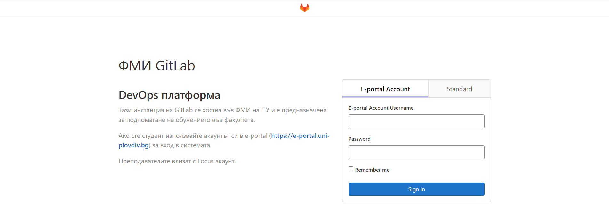

Примерни входни данни
- потребителско име : stu1234567890
- потребителска парола : личната ви парола

## **Създаване на GitLab репозитори**

Изберете бутона New Project за да, инициирате създаването на нов проект.

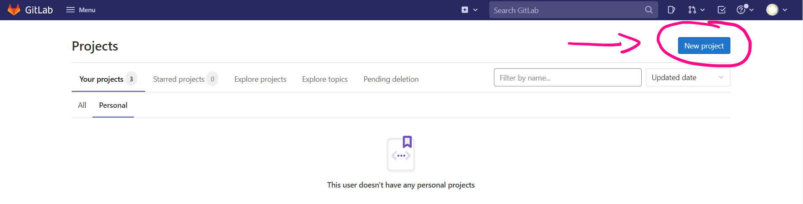

Изберете опцията **Create blank project** 

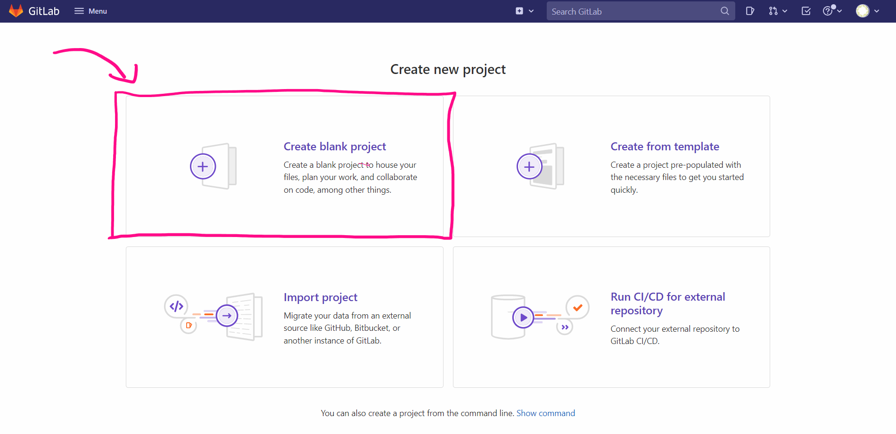

Всяко едно от домашните, които решавате **съдържа в себе си специфичен идентификатор**, който ще използвате за да кръщавате своите проекти. Даваме веднага пример. Домашното за първата седмица ще има следния идентификатор **pu-fmi-java-intro-w1**
- **pu-fmi-java-intro-** - това е идентификатора на курса, той няма да се променя до края на курса
- **w1** - това е номера на домашното, което ще решавате всяка една седмица.

Това означава че ще направите проект, който ще носи същото наименование:
- **Стъпка 1** бъдете сигурни че няма излишни празни пространства или точки, в названието на репозиторито
- **Стъпка 2** натиснете бутона **Create project** и завършете процедурата по създаване на проект

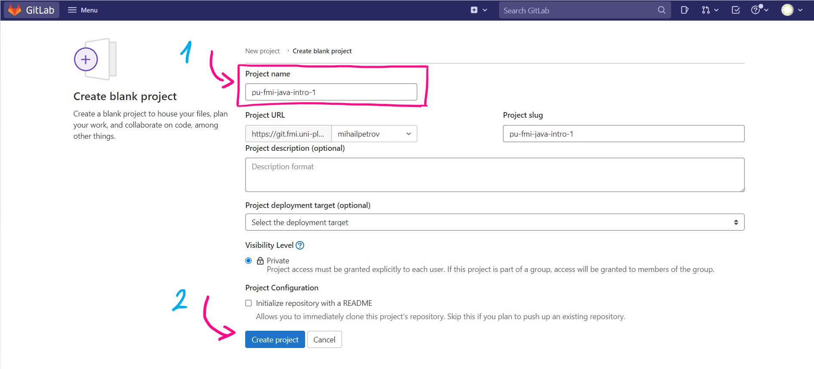

Проекта ви е създаден успешно, ако виждате следната страница

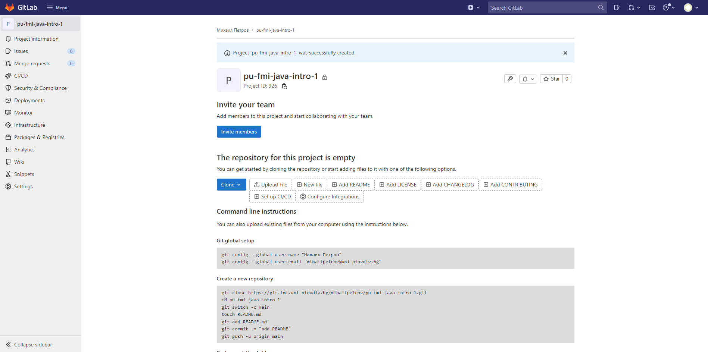

## **Качване на домашното от InteliJ в GitLab**

Работим си спокойно по нашите задачи без да бързаме и без напрежение. Става време да си качим кода в GitLab-a.

Изберете **VCS** -> **Enable Version Control Integration**

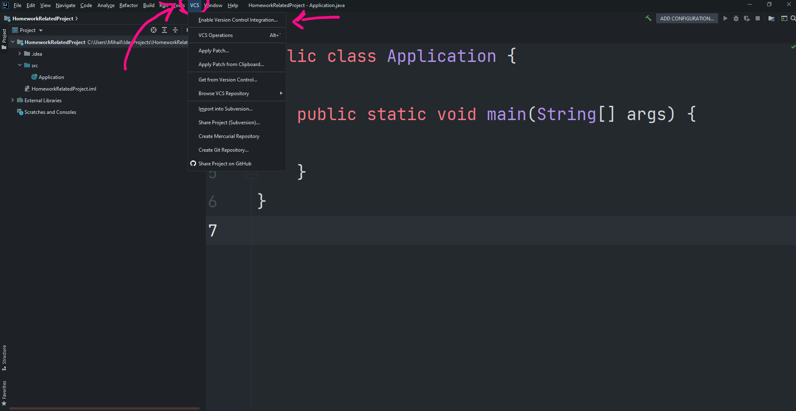

Потвърдете, че ще ползвате **Git** като основна система за управление на версиите и натиснете **Ok**

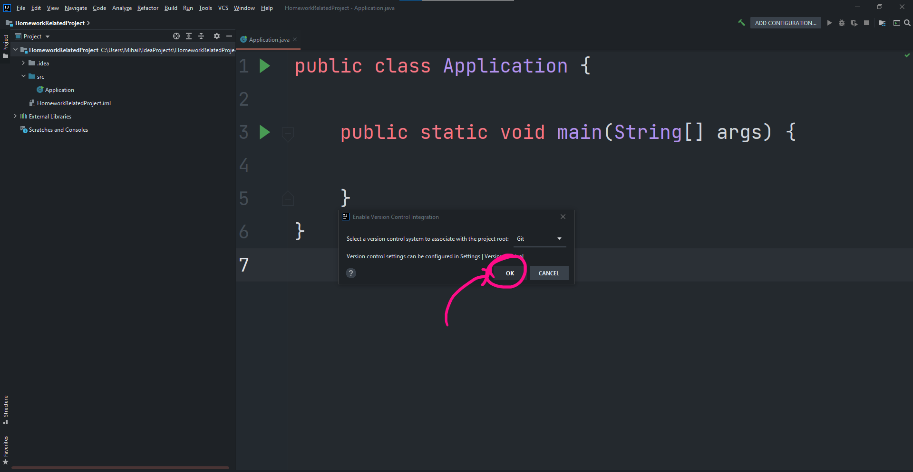

В този момент всичките ви файлове, които все още не са добавени към системата за управление на версиите ще светнат в различен цвят

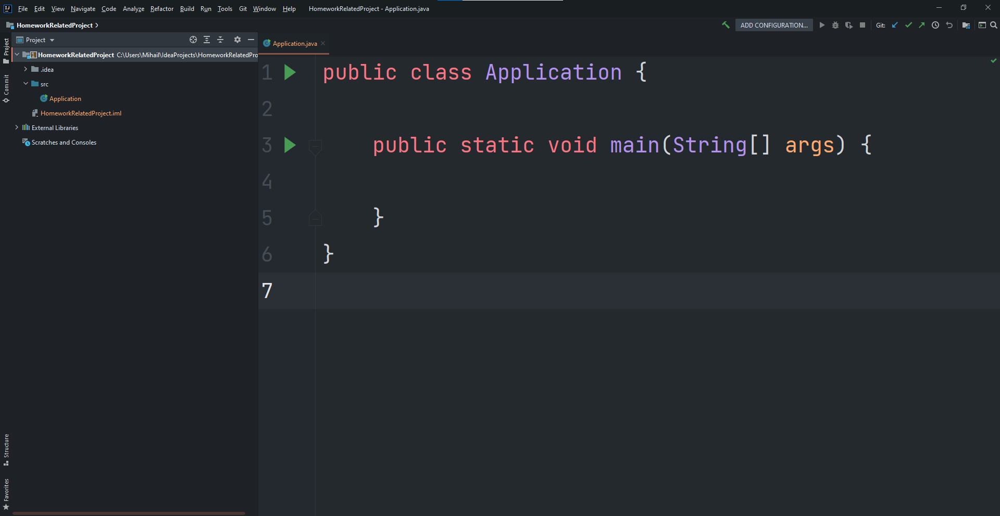

За да добавите, кода си в Git трябва:  
- да селектирате директорията на проекта с ляв бутон
- да натиснете десен бутон
- да намерите менюто **Git**
- да изберете командата **Add**

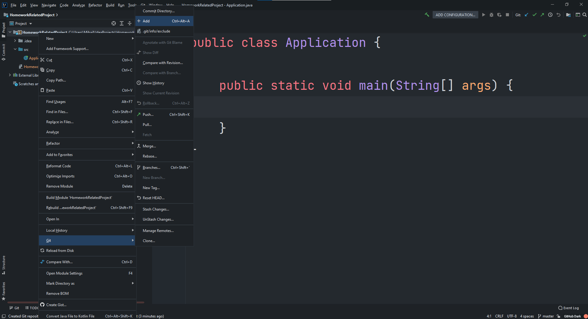

Ще забележите, че веднъж добавени, файловете стават зелени. 

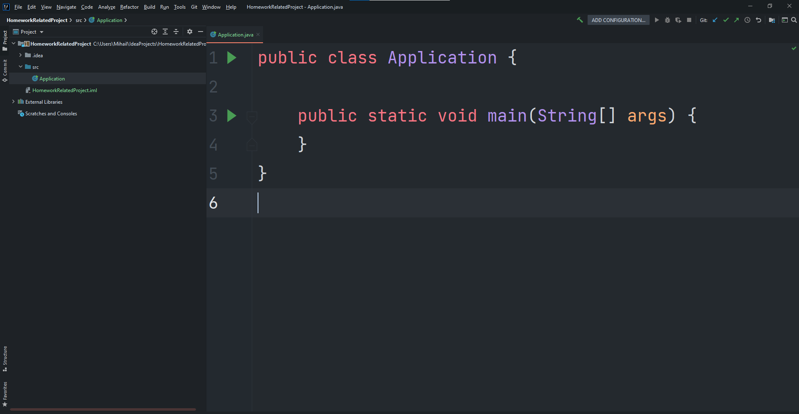

В момента кода ви не е качен в GitLab проекта, който направихме. За да го направите:
- изберете командата **commit**
- уверете се че промените, които сте направени са отразени коректно. не се притеснявайте, че има доста файлове, които не сте писали вие. Те са част от финалната програма
- Напишете съобщение, което да информира системата за вашите промени
- Натиснете бутона **Commit and push**

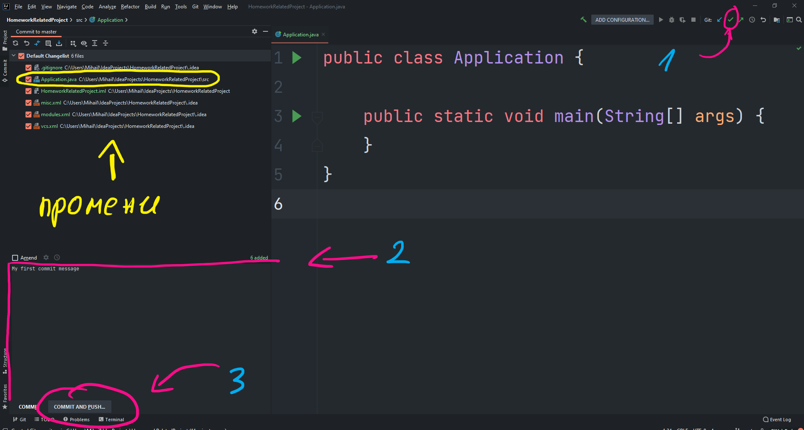

Необходимо е да въведем URL адреса на GITLAB проекта, в който искаме да качим кода си

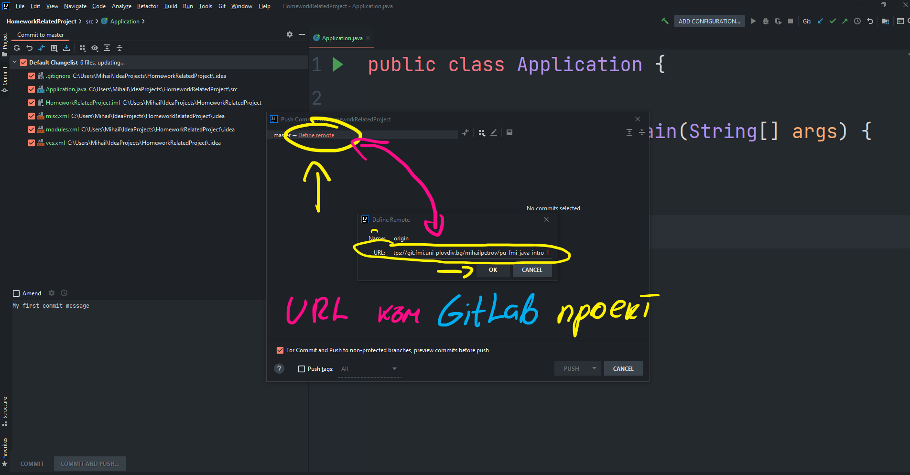

Също така въвеждаме паролата си за достъп

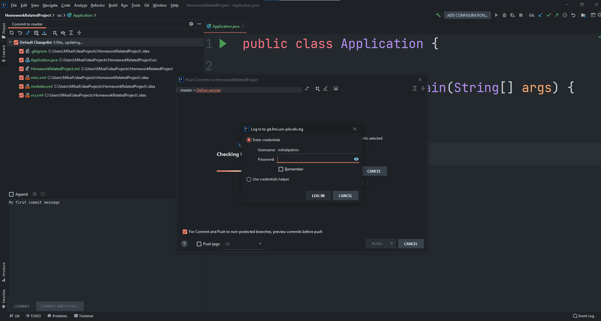

Ако всичко е точно трябва да видите, нещо което прилича на следния екран. Избираме **Push** и кода се качва успешно

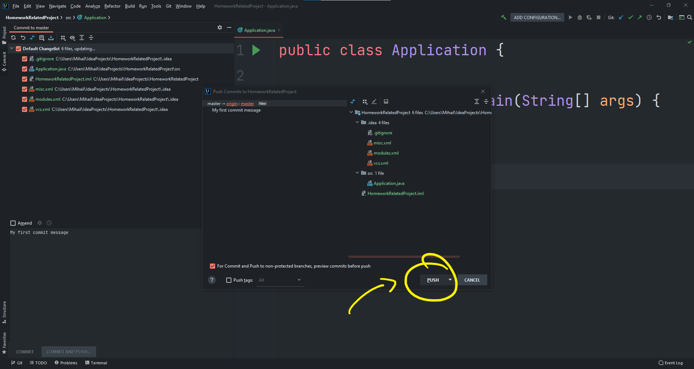

Процедурата се повтаря всеки път когато нанесете нови промени по вашия код. Ако всичко е наред, ще видите кода си в GitLab , проекта който създадохме.

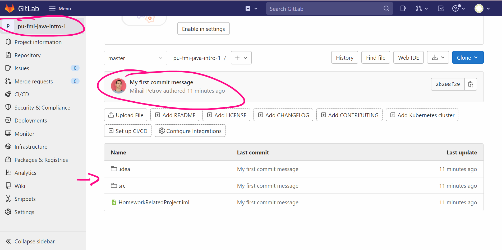

## **Предаване на линк към решението ви**

Линк към хранилището трябва да бъде предоставен в Google Classroom преди крайния срок на заданието. За целта, трябва да го прикачите към заданието и след 
това да го предадете като натиснете бутон **Предай**.

Изберете домашното, което ви е делегирано от преподавателския екип. То ще бъде видимо в Google Classroom -а

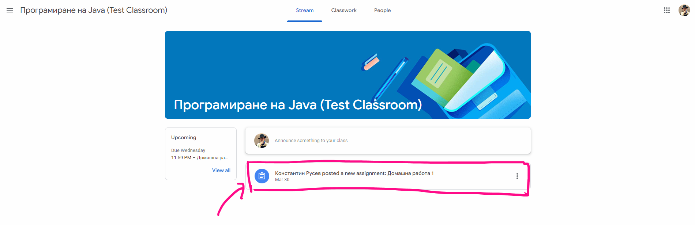

Изберете **Add or create**, след което изберете опцията **Link**

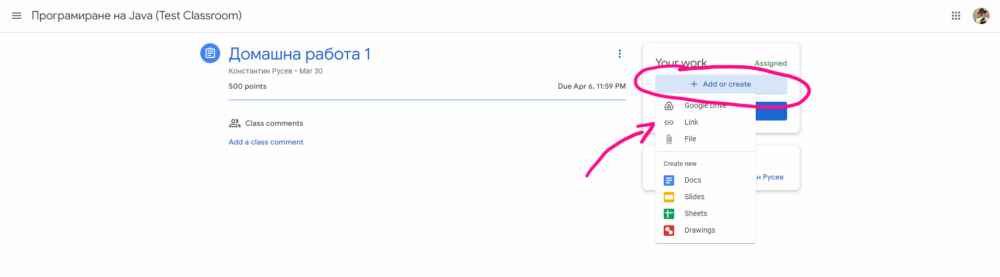

Копирайте линка от GitLab проекта ви и го поставете, в прозорчето за линк

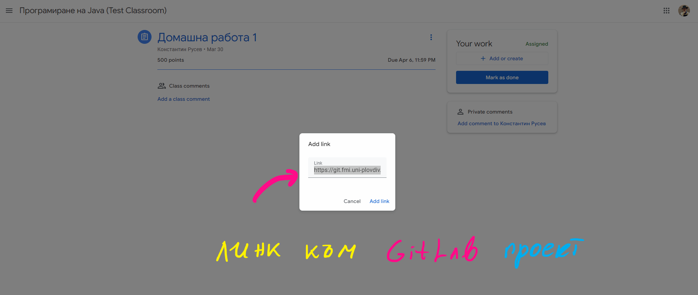

Уверете се че линка е добавен към домашното. Ще бъде видим веднага след неговото добавяне. След като проверите, че всичко е наред изберете бутона **Turn in** и завършете предаването на домашното.

Ето как биха изглеждали всички стъпки от процеса

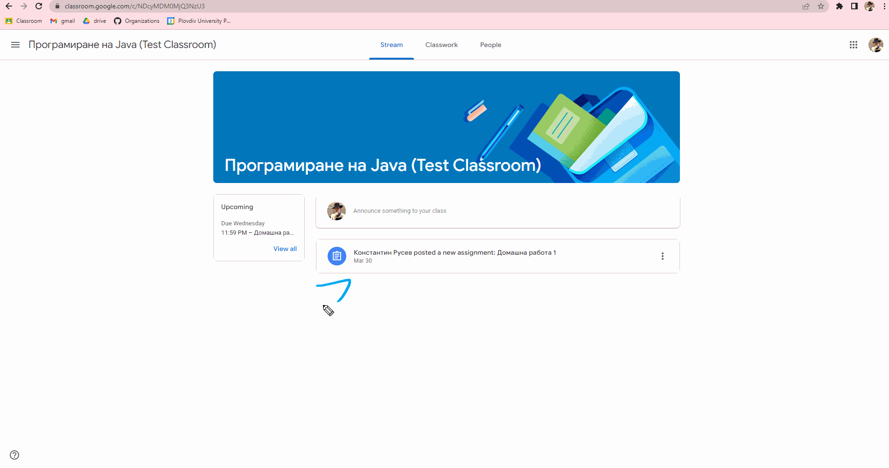

Ако изпитвате затруднение комуникирайте с преподавател за правилния начин, по който да предадете решението. Като е добре това да се случва в срокове различни от последната минута на последния ден.

### **Срокове**

Всяко едно от поставените задания има краен срок, който можете да видите в Google Classroom-ма. По традиция всяко домашно е със срок за работа от една седмица, освен ако изрично не е специфицирано друго. 
Спазването на сроковете е задължително и не търпи корекция, освен при възникване на форсмажорни обстоятелства.