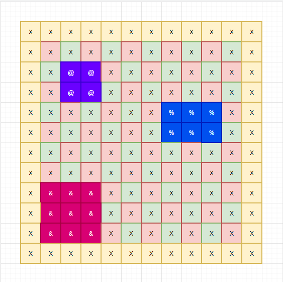

# Песен за вар и цимент

## ВЪВЕДЕНИЕ

Край речица на полянка, кмета Страшо и баба Танка си живеели двамина, цяло лято и цяла зима.   
Щом си дойде Евро фонд, тъпчат те във стар балтон, пачки евро и валута, кошница с пари издута.

Вчера кмета чак си взема чисто ново BMW, с ръчни скорости върви, кожен салон от норки и тигри. Кара важно из махлата, всички цъкат със устата., Псуват викат страшна схема, маскара боклук анатема.

Баба Танка, тя си е чистница, домакиня и кралица. Знае всичко в този дом, де седи и де е то. С мопа бърше ламината, всичко свети на земята, построи си дом палат, да завижда целии свят.

Селото било красиво, тихо весело игриво. Тичали децата боси, цапали се и задавали въпроси, гонели врабците сред житата, слънце им огрявало лицата, райско кътче на земята НО дошла бедата.

Страшо страшен бизнесмен, сключил договор почтен. С инвеститор грозен и дебел, повелител на картел. В мигом багери изсипал тон, ще залее всичко със бетон, арматура и цимент трябват те на тоз терен. Туй ще бъде най-добро, с алуминий и стъкло, гипс и фазер теракол, по най-последен протокол. Искам сгради до небето, от тавана до антрето, всичко в злато и коприна туй е моята доктрина.

Марш от моята земя, грозно Бизнесмена се прозя. Всички селски пръчки да си ходят, няма тук чапкъни да ми бродят. Искам до една неделя тука всичко да е празно от боклука. От **бабе** до внук и щерка хващат пътя и офейкват. Хич не искам възражение туй е моето решение.

И изсипал се цимента, почнал багера акомпанимента, музика за мойте ушни миди, сгради три, прекрасни като пирамиди. Малка средна и голяма, за парата спирка няма.

Армия от селяни зловещи с търнокопи и със стари клещи, със тояги, оксижен се изправят срещу тоз гамен. Тука трябва организация, да сплоти сърцата на разпасаната нация, Викна местния гробокопач и отсече трябва ни **Водач**. Ние имаме ресурси за отбрана, но умения си нямаме за тази драма. Искаме акъл да ни даде, в боя смело да ни поведе.

Младо програмистче се притече, на селяците работата да изпече. В миг започна код да пише, план модерен ще предпише. Туй се вика боен план, за постигане на резултат желан. Хващай те се всички плана да ви редя, с ентусиазъм аз да ви заредя. Чичо Митко взимай търнокопа, бай Иване ти си с тая сопа, искам да запашеш пръчка динамит, да изчезне този ум промит. Чичо Киро ти си със шишето, ще ни вардиш скришно ти от пиандето, а пък с този камък най голям ти Страхиле ще замятваш без капка срам.

Армия готови сме за бой, тука днеска всеки е герой. Да си върнем селото дивашко, в кръчмата очаква ни банкет юнашки

## СПЕЦИФИКАЦИЯ

Разполагате с армия от 4 ма селяни специализирани в следните направления :

-   Тракторист хулиган (танк)
-   Хвърляч на камъни (снайперист)
-   Пиянде ( шпионин )
-   Рибар (саботьор с динамит)

Трябва да навигирате армията си от добре обучени машини за убиване до територията на врага и да неутрализирате строително ремонтните дейности в селото. Мисията се извършва върху квадратна решетка (**строителен обект**) с размери 15 x 15. За целите на описанието ще използваме изображение, на квадратна решетка за да стане по ясно, за какво иде реч.

Цвета на квадратчетата **няма никакъв функционален** смисъл, те съществуват само за да организират подходящ контраст при разглеждане на примерите. Съдържанието на квадратчетата символа **X ще се използва за визуализация на празно пространство в рамките на дъската, когато навигирате вашите единици по терена.**

**  
**

### **ЦЕЛИТЕ НА НАШАТА МИСИЯ**

На полето са позиционирани 3 различни сгради с различна конструкция, и на различно място на картата. **Противниците ни са дефинирали следните размери, характеристики и символна спецификация на техните сгради.**

| **Сграда** | **Брой заемани квадратчета** | **Символ** |
|------------|------------------------------|------------|
| Малка      | 4 квадратчета                | \*         |
| Средна     | 6 квадратчета                | %          |
| Голяма     | 9 квадратчета                | &          |

Примерна визуализация на карта с позиционирани върху нея сгради готови за взривяване. Цветовата схема е само за примера и няма отношение към крайната имплементация.

### **ПРАВИЛА ЗА ПОЗИЦИОНИРАНЕ НА СГРАДИТЕ ВЪРХУ КАРТАТА**

Архитектурните стандартни, диктуват изключителна стриктна спецификация при позиционирането на модерните, стъклено-алуминиеви замъци. Разстоянието между всяка една от сградите трябва да е **минимум три реда или три колонки**.

На примерната визуализация разстоянието от Голямата сграда до средната **е два реда** (отбелязани с жълто), но разстоянието по колонки е три колонки, което отговаря на условието.

Разстоянието от началото на работната площадка до всяка една от стените на сградата трябва да бъде минимум един ред и една колонка.

**БОЙНА БРИГАДА**

Разполагате с армия от 4 ма селяни специализирани в следните направления :

| **Специалист**     | **Название** | **Идентификатор на бойна единица** | **Тип умение** |
|--------------------|--------------|------------------------------------|----------------|
| Тракторист хулиган | Танк         | 1                                  | Пасивно        |
| Хвърляч на камъни  | Снайперист   | 2                                  | Пасивно        |
| Пиянде             | Шпионин      | 3                                  | Пасивно        |
| Рибар              | саботьор     | 4                                  | Специално      |

За улеснение, всеки един от геройте е отбелязан с различен цвят, в зависимост от тяхната роля, с цел лесна комуникация и обяснения.

Бойните ни другари са подбрани специалисти, като всеки един от тях е носител на специално или пасивно умение. Специалните умения се активират от потребителя, с помощта на клавиатурата, докато пасивните умения се активират при настъпване на определено обстоятелство, автоматично от играта:

-   **Саботьора** разполага със специално умение, за залагане на експлозиви.
-   **Снайпериста** намалява шанса за успешен изстрел на противникови единици по бойната група, на половина
-   Ако в групата има танк, ако противник успешно стреля по групата то танка умира автоматично
-   Ако в групата има пианде, то групата може да преминава през крайщата на картата. [Ако се намираме в колонка номер 0 то при движение на ляво, ще се появим в колонка номер 14 от картата]

### **БОЕН РЕД**

Бойната бригада е добре организирана структура, която вплита в себе си всички принципи на военната стратегия и последователните действия. Поради тази причина е необходимо да се спазва ясна дисциплина, която да кореспондира с това кой е първия в бойния ред и кои са последователите в даден момент.

За тази цел, е необходимо да добавим още един **допълнителен номер** **пред** идентификатора на бойната единица, с които да покажем, заеманата позиция в бойния ред.

Така ако например в даден момент, специалист с идентификатор [3] **заеме лидерска позиция** в бойни ред, то конфигурацията на бойната бригада би изглеждала по следния начин

### **НАЧАЛО НА БОЙНАТА МИСИЯ**

Всяка една бойна мисия започва от долния десен ъгъл на дъската. **Задължително е тези четири квадратчета които ще бъда окупирани от специалистите да бъдат свободни от сгради и други препятствия.**

Разстоянието от стартовата позиция на ударната бригада, до всяка една от сградите трябва да бъде минимум три реда и три колонки.

### **ПРИДВИЖВАНЕ НА БОЙНАТА БРИГАДА**

Придвижването на вашите бойни другари се извършва в **индианска нишка, всеки следва предишния**. По време на всеки ход можете да изберете посока на придвижване като вашата групичка трябва да се придвижи с по едно квадратче в посоката която сте избрали.

### **ПРЕМИНАВАНЕ ПРЕЗ СГРАДИТЕ ПО ВРЕМЕ НА ПРИДВИЖВАНЕ**

Докато извършвате, тактическите си действия можете да преминавате спокойно през сградите. Всичко е отключено няма страшно. Когато го правите върху картата се визуализират идентификаторите на единиците, вместо този на сградата.

****

Опа, момент, оказа се че не можете да преминавате през средните колони на средната сграда, **сори** законите на физиката диктуват смирение и интегритет. Отбелязали сме всички квадратчета през които можете да преминавате на картата, с прекрасен жълтеникав цвят.

****

### **УНИЩОЖАВАНЕ НА ПРОТИВНИКОВИ СГРАДИ**

Основната цел на бойната ни мисия е да унищожим всички противникови сгради. По данни от нашите, достоверни експерти по строително архитектурни и други дейности, е необходимо просто да заложим взрив в основите на целите ни и хоп, проблемите ни ще изчезнат.

Всяка сграда има четири ъглови колони, които са ключовата цел в нашите тъмни дела. За щастие не е необходимо да ги атакуваме всички. До колкото ми е известно стратегически поставен взрив на точното място може да свърши работата, като ще остане време и за почерпка.

Експертния доклад показва че:

-   Малката сграда ще бъде унищожена след като се взриви само една от колоните й
-   Средната сграда трябва да бъде атакувана диагонално, като е необходимо да заложим тротила върху две от колоните и
-   Голямата сграда трябва да поеме пет пръчки динамит 4 колони + централна

На схемата сме отбелязали точките на пропукване, които трябва да бъдат атакувани, бързо и елегантно. (**Белите квадрати около сградите са за контраст**)

Както виждате:

-   Малката сграда може да бъде атакувана от всяка колона (Затова и четирите са жълти)
-   Средната сграда може да бъде атакувана от двата диагонала (Отбелязани са с жълт и лилав цвят)
-   Голямата сграда може да бъде атакувана само от страничните колонки + централната такава

### **ХАРАКТЕРИСТИКИ НА ИЗПОЛЗВАНОТО ВЗРИВНО ВЕЩЕСТВО**

Бай Иван, рибаря твърди че, веществото с което разполага е най-ефективното приспособление за набавяне на вечеря, борба с диви животни и унищожаване на стоманобетонни конструкции. Но има една малка уловка, която е свързана с времето на реакция. В момента в който заложите динамита, **имате само пет хода** да се придвижите извън обсега на целта ви.

При успешен взрив, квадратчето върху което е заложен експлозива ще изчезне, като върху картата то ще бъде отбелязано със символ **[X]** празна територия. Всички съседни квадрати които са в обсега на взрива ще бъдат засегнати **само ако на тях са разположени живи единици. Всички бедни души позиционирани на заветните квадрати, предават Богу дух и напускат пределите на реалността. Съседни наричаме само квадратите които заграждат атакуваното квадратче от картата.**

**Внимание. Настъпването на взрива се случва по време на шестия ход, на бойната бригада считано от момента в който се заложи бомбата. Взрива се активира преди бойната бригада да получи възможност да направи действие.**

**Ако взрива предизвика фатални конструктивни дефекти, за дадена сграда, то в рамките на следващия ход територията, която е била окупирана от сградата ще бъде заменена със символа [X] празна територия.**

### **ПРОТИВНИЦИ**

По данни на нашите източници, скъпите сгради се наблюдават от елитен, охранител известен като бай Петкан, пазача. Безкомпромисен тип, отлично трениран, в положителните градуси на местния казан за варене на ракия и отрицателните такива на селските канавки. Бай Петкан обхожда терена на случаен принцип като се придвижва по едно квадратче, в посока случайно избрана в рамките на всеки ход. На картата на бойната мисия, ще отбележим мнимия ни враг със символа [**\$**]

Ако забележи някой от специалистите, ще възпроизведе изстрел по всички правила на безопасното боравене с ловна пушка.

Самия процес по забелязване се случва само когато бай Петкан се намира в непосредствена близост, (**едно квадратче** ), от бай Петкан до който и да е от бригадата.

При забелязване на противника бай Петкан, вади пушкалото и хвърля 24 стенен зар. Ако числото се дели на **11 без остатък**, то от дуото политат съчми гайки и порони към заветната цел.

**Ако опита е неуспешен** бай Иван побягва панически като се позиционира на един от четирите края на картата. В началото на следващия ход, движението му стартира от произволно място от един от четирите най-крайни квадрата, на случаен принцип.

**Ако опита е успешен** бай Иван отива до кабинката на пазача, за да си сипе едно за отскок и да зареди оръжието за нова конфронтация. Къщичката на пазача се намира извън територията на бойната мисия, поради тази причина, повлиян от неимоверния си успех, следващите 4 хода няма да видите грозната му физиономия.

**!!! Важно.** Винаги, когато се възпроизвежда изстрел убит е само водача на групата. Другите остават невредими. Освен ако в сила не са специалните пасивни умения на специалистите.

### **ТАКТИЧЕСКИ ДЕЙСТВИЯ НА БОЙНАТА БРИГАДА**

Бойната мисия се провежда на ходове, по време на всеки един от ходовете се случват следните активности:

-   Избор на тактическо действие
-   Придвижване на противника бай Петкан

#### **Придвижване**

За да се придвижите е необходимо да ползвате символите

-   W – за движение напред
-   A – за движение на ляво
-   D – за движение на дясно
-   S – за движение на долу

Бойната бригада се придвижва само по посока определена от Лидера, в групата.

**Смяна на водача**

**Операцията по смяна на водача се случва със символа C.** След което на конзолата се листват всички живи единици, със символи до техните названия. Избираме символа и променяне водаческата листа. Текущия водач **винаги** сменя своето място, с това на новия водач. Ако на лице е само един единствен специалист, тази опция не трябва да се визуализира. **Изведете подходящо съобщение**

#### **Извършване на специални действия**

Специално действие се случва само от страна на единиците които имат, специална способност. То се случва с натискане на бутона F.

**!!!Внимание** Само и единствено вода ама възможност да извършва специални действия. Ако водача няма специални действия в арсенала си то тази опция на е достъпна. **Изведете подходящо съобщение.**

### КРАЙ НА МИСИЯТА

**Бойното действие приключва, при достигането на едно от тези две обстоятелства :**

-   Мисията е успешна ако всички сгради бъдат унищожени
-   Мисията приключва трагично ако саботьора бъде убит