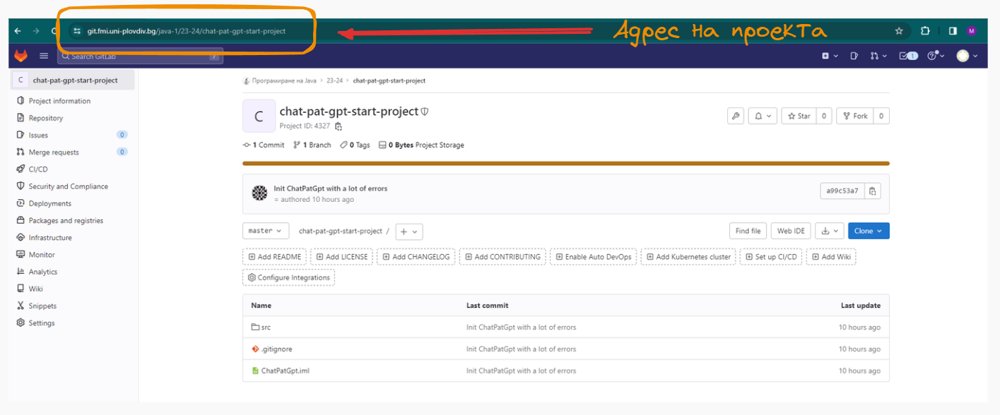
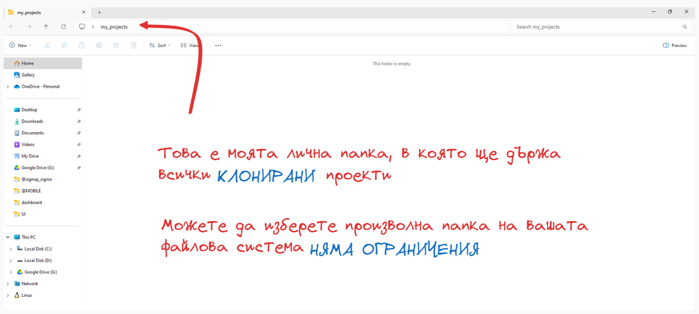
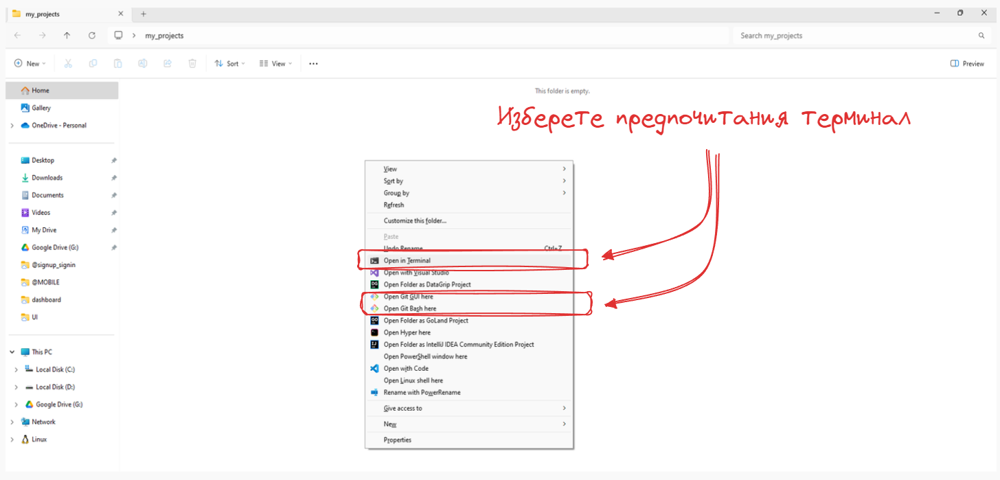
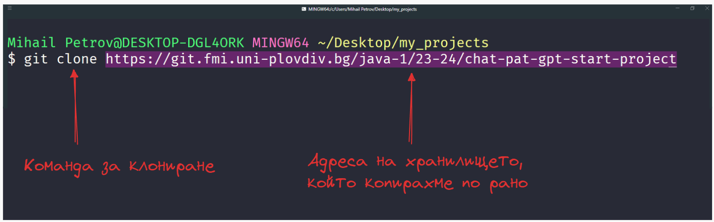
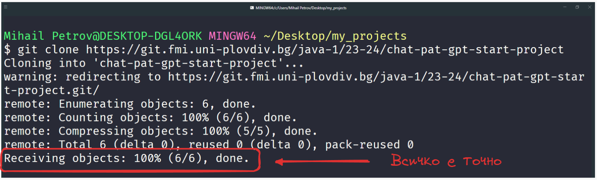
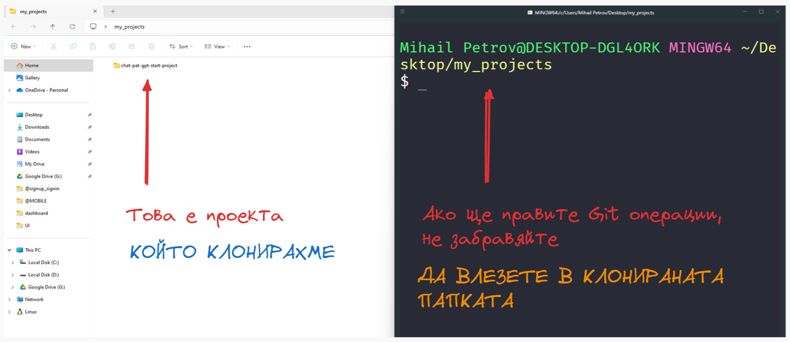
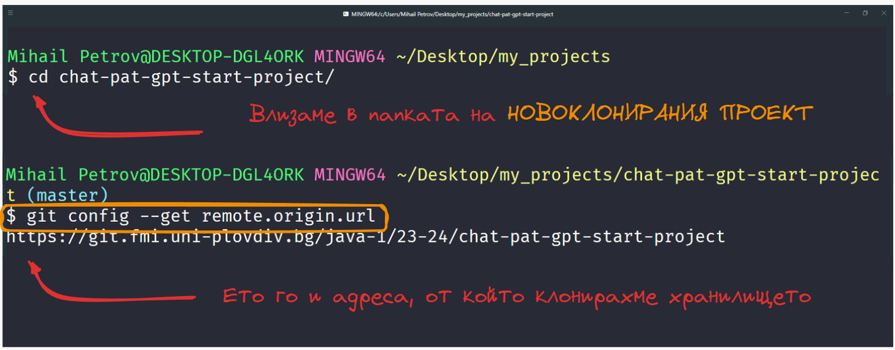
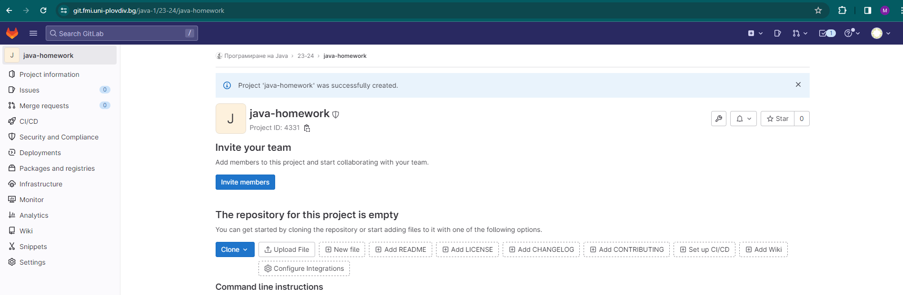
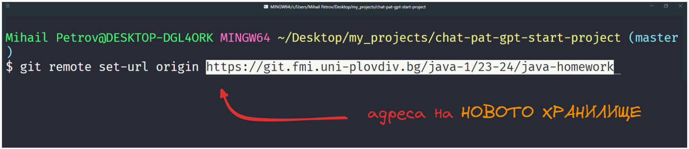

# Как да клонираме хранилище - с помоща на Git конзолата

Едно от най-новите предизвикателства пред които се изправяме е клонирането на чуждо хранилище, в което да работим. В света на Git има много стратегии, как да адресираме този проблем, но днес ще разгледаме най-тривиалния.  В тази статия, ще разгледаме как да свършим тази работа с помоща на Git конзолата.

## Как да го направим с помоща на GIT конзолата

### Как да клонираме, отдалечено хранилище ? 

Първата ни задача е да посетим, GitLab и да открием проекта, които ще клонираме. В този случай ще ползваме като пример проекта от **домашна номер 3**, който можете да откриете на адрес.

> https://git.fmi.uni-plovdiv.bg/java-1/23-24/chat-pat-gpt-start-project

Ако имате интереси към произволен проект, винаги обръщайте внимание на неговия URL адрес, това е пътя да хранилището. 

Копирайте адреса и се насочете към вашата локална файлова система. 

Избрах да си направя папка **my_projects**, в която ще си съхранявам клонираните проекти. Можете да изберете произволна директория на вашия компюрът, няма изисквания за название и място. 

Смело натиснете едновременно **SHIFT** + **десен бутон на мишката** и отворете любимия ви терминал, в рамките на директорията, в която ще клонирате проекта.

 Терминала е дълбоко персонализирана програма и има огромен шанс, това което виждате в картинките цветово да не прилича на вашия терминал.
 - Ако използвате по-стара версия на Windows, най-вероятно е визуализиран и терминал, които се нарича Powershell, които е алтернатива на стандартното CMD.
 - Ако ползвате Mac, терминала по подразбиране е един единствен.
 - Ако ползвате Linux, терминала по подразбиране е един единствен.

След като вече имаме отворен терминал, е време да клонираме. Командата за клониране на отдалечени хранилища, е **git clone** като задължително трябва да се даде адреса на отдалеченото хранилище. 

> git clone https://git.fmi.uni-plovdiv.bg/java-1/23-24/chat-pat-gpt-start-project

Натиснете Enter и се насладете на успешното клониране. Ако всичко е наред, системата ще ви изпише необходимата системна информация, със статус 100%. 

**Внимание**: Ако не сте се логвали до сега в GitLab или не сте извършвали действия, които предполагат въвеждане на потребител и парола, системата може да ви изведе прозорче, очакващо входни данни от вас. 

След успешно клониране, ще видите новоклонираната директория на мястото от което отворихме конзолата, от тук на сетне можете да работите спокойно с проекта, тои ВЕЧЕ има инициализиран **git**.

### Какво е origin и защо ни интересува ? 

Хранилището което клонирахме и нашия новоклониран локален проект споделят една специална връзка. Тази връзка често се нарича origin по традиция или иначе казано - локалното ви хранилище знае от къде е дошло. 

Ако направите каквато и да е промяна, в локалното ви новоклонирано хранилище **git add** / **git commit** и се опитате да я качите **git push** -  То това директно ще промени кода в отдалеченото хранилище. 

Нека да погледнем какъв е адреса на отдалеченото ни репозитори. Първо нека да влезем в папката на проекта, като след това ще ползваме командата 
> git config --get remote.origin.url

### Смяна на origin, какво пък е това ? 

И какво от това, защо ни вълнува. Ами често ние искаме да използваме кода, които сме клонирали, но не искаме да афектираме хранилището от което сме го клонирали. Затова трябва да видим как можем да премахнем връзката между локалното хранилище и отдалеченото, като я заменим с нова към друго наше собствено хранилище. 

Ще си направим едно ново хранилище наше лично персонално, което ще кръстим **java-homework**. След създаването му искаме по същата процедура да вземем неговия адрес от URL адреса на браузъра. 

След като разполагаме с новия адрес, отново ще отворим, конзолата и ще въведем командата 
> git remote set-url origin https://git.fmi.uni-plovdiv.bg/java-1/23-24/java-homework

От този момент нататък, всяка една промяна, които правим в нашето локално хранилище ще се отрази в новото ни отдалечено хранилище. 