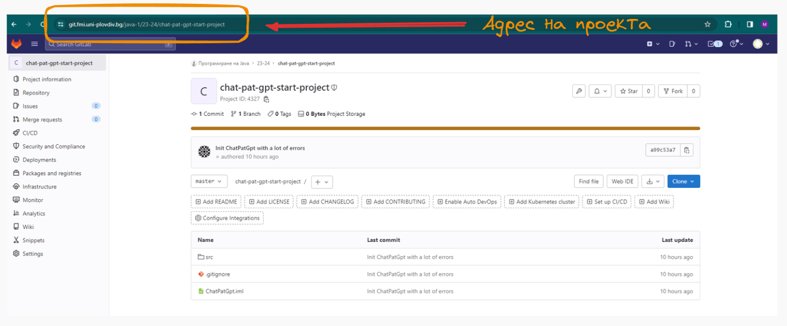
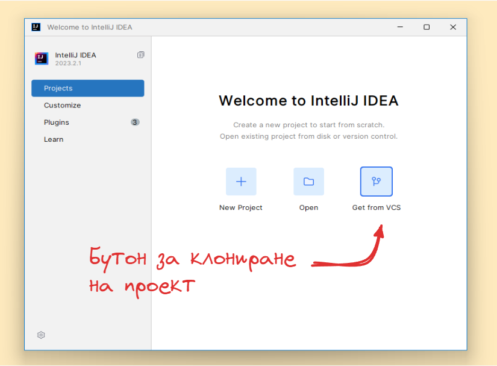
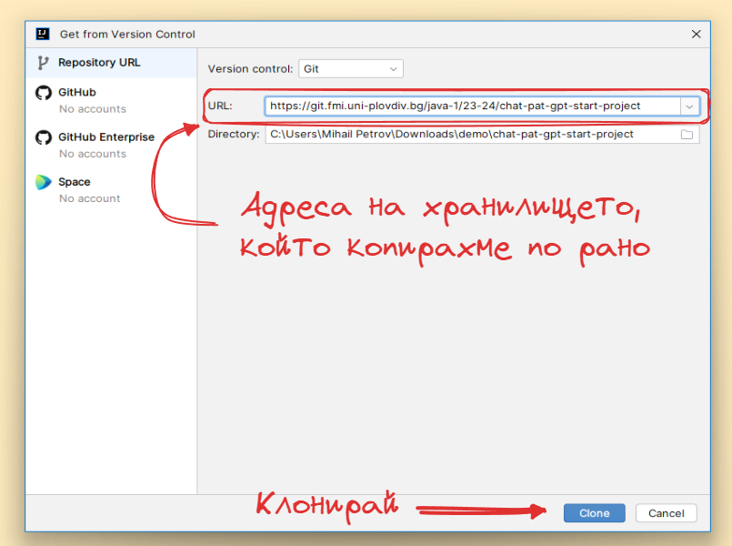
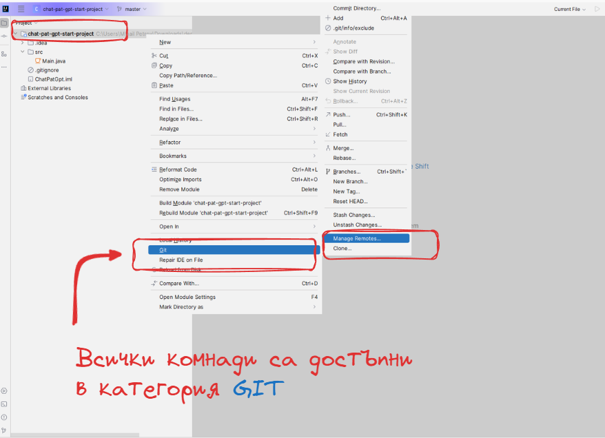
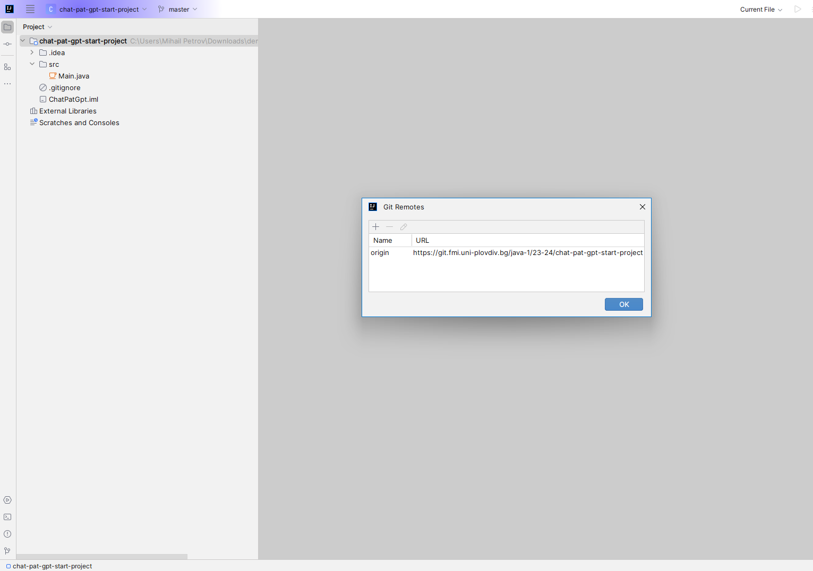
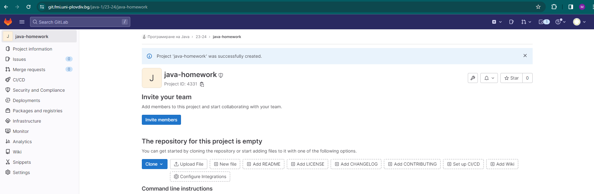
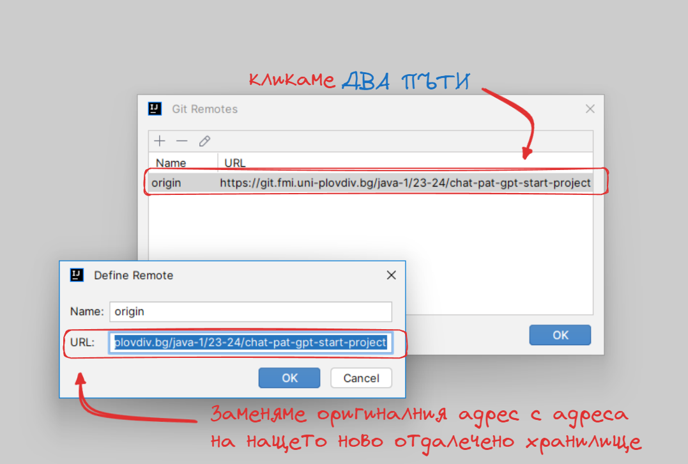

# Как да клонираме хранилище - с помоща на InteliJ

Едно от най-новите предизвикателства пред които се изправяме е клонирането на чуждо хранилище, в което да работим. В света на Git има много стратегии, как да адресираме този проблем, но днес ще разгледаме най-тривиалния. В тази статия, ще разгледаме как да свършим тази работа с помоща на InteliJ Idea.

Първата ни задача е да посетим, GitLab и да открием проекта, които ще клонираме. В този случай ще ползваме като пример проекта от **домашна номер 3**, който можете да откриете на адрес.

> https://git.fmi.uni-plovdiv.bg/java-1/23-24/chat-pat-gpt-start-project

Ако имате интереси към произволен проект, винаги обръщайте внимание на неговия URL адрес, това е пътя да хранилището. 

Копирайте адреса и отнорете, InteliJ Idea. 

Понеже искаме да започнем от вече съществуващ проект, изберете опцията **Get from VSC**. 

Приложението ни предоставя лента в която да поставим линка които вече копирахме от проекта в GitLab. Поставете го там и се уверете че системата за управление на версиите е Git. Натиснете бутона **Clone** и изчакайте няколко секунди докато се свали проекта.

**Внимание**: Ако не сте се логвали до сега в GitLab или не сте извършвали действия, които предполагат въвеждане на потребител и парола, системата може да ви изведе прозорче, очакващо входни данни от вас. 

Сваления проект, ще се визуализира като стандартен InteliJ проект с вече инициализирано, Git хранилище. 

### Какво е origin и защо ни интересува ? 

Хранилището което клонирахме и нашия новоклониран локален проект споделят една специална връзка. Тази връзка често се нарича origin по традиция или иначе казано - локалното ви хранилище знае от къде е дошло. 

Ако направите каквато и да е промяна, в локалното ви новоклонирано хранилище **git add** / **git commit** и се опитате да я качите **git push** -  То това директно ще промени кода в отдалеченото хранилище. 

Нека да погледнем какъв е адреса на отдалеченото ни репозитори. Натиснете десен бутон върху проекта, откриите категорията **Git** след това под категорията **Manage remote**

В отворения прозорец ще видите всички връзки към външно отдалечено хранилище, което е закачено към локалното ни такова. 

### Смяна на origin, какво пък е това ? 

И какво от това, защо ни вълнува. Ами често ние искаме да използваме кода, които сме клонирали, но не искаме да афектираме хранилището от което сме го клонирали. Затова трябва да видим как можем да премахнем връзката между локалното хранилище и отдалеченото, като я заменим с нова към друго наше собствено хранилище.

Ще си направим едно ново хранилище наше лично персонално, което ще кръстим **java-homework**. След създаването му искаме по същата процедура да вземем неговия адрес от URL адреса на браузъра. 

След като разполагаме с новия адрес, отново трябва да се обърнем към прозорчето за управление на отдалечени адреси и да сменим съществуващия origin с този, които сме взели от отдалеченото хранилище.

От този момент нататък, всяка една промяна, които правим в нашето локално хранилище ще се отрази в новото ни отдалечено хранилище.