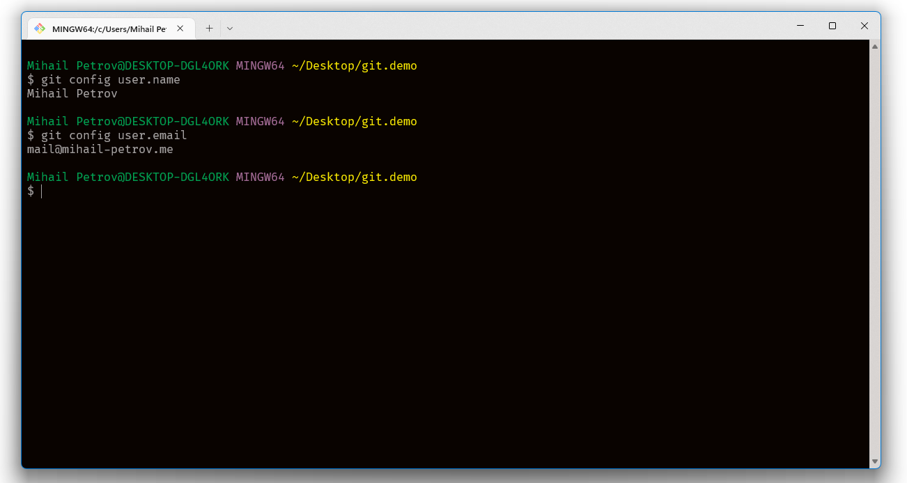
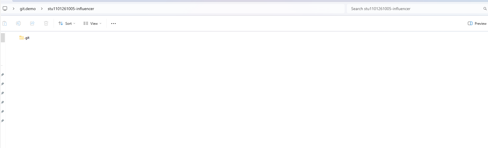

🟦 **Домашна работа 2**
# Скъпи млади инфлуенсъри

### 🚀 Въведение

Младия врабец Борко завършил успешно 8 клас и демонстративно отказал да учи ВиШу. Отворил вестниците за обяви и с мъка установил, че няма, нито желание, нито знания да работи каквото и да е било. Ужасен от собственото си ниво на некомпетентност, той си купил видео камера и започнал смело да се занимава с единственото нещо на този свят, за което не се изисква никакъв специален талант - инфлуенсърство. 

Решен на всичко да покори нови дъна, успешно създал малко китно студио в обкражението на собствения си дом. Създавал си акаунти в социалните мрежи и започнал безпардонно да бълвате безграничната си мъдрост в дигиталната сред своята цифрова аудитория. Няколко мъчителни часа по-късно Борко осъзнал, че все още не е милионер и горчиво заплакал в мазолестите си шепи. Пронизан от стрелата на прозрението и силно смутен от лизинговата техника в дома му - той набързо скалъпил нова бизнес стратегия, която предполагала разработката на така наречения БЛОГ за популяризиране на мъдрите си инфлуенсърски мисли. Разрбал, че в Gitlab ще може да съхравява цялото съдържание на платформата си без да плати нито лев и уверен в уменията си - бързо се спуснал към лаптопа си с желание да твори.

Помогнете на Борко да сбъдне мечтите си.

### 💡 Изисквания към заданието

Свалете и инсталирайте Git на вашата машина и го конфигурирайте глобално с вашия университетски е-mail и парола. Направете снимка (sceenshot) на резултата от вашата конзола - като снимката трябва да се казва: **git-flow-state-1**. Искаме да видим нещо подобно на това:

Направете **собствено хранилище (repository) в Gitlab**, с название **stu{ФАКУЛТЕТЕН НОМЕР}-influencer** и го клонирайте в локална директория по ваш избор. Направете снимка (sceenshot), който да показва клонираната директория, заедно с **.git** папката в нея. Озаглавете снимката по следния начин: **git-flow-state-2**

Време е да поработим в локалната ви директория. Направете един единствен файл, който ще кръстите **README.md**, в който да разкажете за: 
- вашите специални умения като content creator, 
- сферата на вашето познание и 
- сферата, в която се развивате. 

**В рамките на минимум 5 къмита (commit) трябва да качите:**
- информация за вас;
- информация за вашите хобита и интереси;
- линк към материал на любим content creator, които ви е вдъхновил;
- информация за вашия канал, какво ще правите, как ще го правите и какво да очакват феновете;
- примерно остойностяване на вашите услуги;

Всяка една от тези точки трябва да се намира в отделен къмит (commit), във вашето Git хранилище (repository). 

**Създайте отделен бранч (branch) с наименование images** - бранчът трябва да съдържа 3 файла: 
- **един файл** (*git-logs.png*), съдържащ изображение на вашата git история за последните 5 къмита (commit).
- двете изображения, които направихме по-рано.

Отворете проекта си от миналото домашно или направете нов ако сте го изтрили. Откриите как да инициализирате празно git repository в IntelliJ интерфейса, след което си добавете всички файлове, които са част от проекта. Искаме да качим всички файлове в Gitlab, затова ще ни се наложи да направим второ хранилище **stu{ФАКУЛТЕТЕН НОМЕР}-java** и да добавите адреса му към празното git repository, което си създадохте. Качете (push) всичките файлове, които създадохте.

Направете няколко снимки, които да демонстрират най-важните моменти от този процес. Качете снимките в отделна директория на бранча **images** - кръстете директорията **idea**.

Върнете се в **stu{ФАКУЛТЕТЕН НОМЕР}-influencer** и добавете нов ред към към README.md който да съдържа **линк** към вашето Java репозитори. Качете промените си. 

> Ако сте се зачудили какво е това странно разширение "md" - то идва от специален език за форматиране на текст, който се превърна в дефакто стандарт при организиране на web документи. Езикът е елементарен и може да се усвои за 5 минути. Затова оставяме на вас да проверите как се прави линк в Markdown, а ако искате допълнителна помощ, [можем да се погледнем документацията](https://www.markdownguide.org/).

Спазвайте следните правила при именуване на къмит съобщенията:
- Опишете ясно какво променя commit-ът (Избягвайте общи или неясни изрази);
- В началото на съобщението поставете кратко заглавие (до 50 символа);
- Използвайте настоящо време;
- Началото на заглавието може да бъде ключова дума, като "Add:", "Fix:", "Update:" и други, за да улесните сканирането на историята.

### 🪚 Допълнителни бележки и уточнения

Искаме да свикнете с идеята, че Git съществува, в този ред на мисли, се постарайте да извършите всички операции, които описахме с помощта на конзолния интерфейс на Git. Знаем, че това може би ви ужасява, но ще се опитаме да дадем достатъчно изчерпателни инструкции.
- [свалете и инсталирайте Git](https://git-scm.com/download/win)
- [направете настройки](https://www.youtube.com/watch?v=gpPnTodCMiU&ab_channel=SteveGriffith-Prof3ssorSt3v3)
- разгледайте отново как се прави добавяне (add), къмитване (commit) и качване на файлове в централния сървър (push)

### Критерии за оценяване

<table>
  <tr>
   <td>
     <strong><em>Функционалност</em></strong>
   </td>
   <td>
     <strong><em>Точки</em></strong>
   </td>
  </tr>
  <tr>
   <td>
     Направете *собствено хранилище (repository) в Gitlab*, с название *stu{ФАКУЛТЕТЕН НОМЕР}-influencer*
   </td>
   <td>10</td>
  </tr>
  <tr>
   <td>
     Създаване на 5 къмита в основния бранч
   </td>
   <td>15</td>
  </tr>
  <tr>
   <td>
     Създайте отделен бранч (branch) с наименование images - бранчът трябва да съдържа 3 файла
   </td>
   <td>10</td>
  </tr>
  <tr>
   <td>
     Направете ново хранилище *stu{ФАКУЛТЕТЕН НОМЕР}-java*
   </td>
   <td>10
   </td>
  </tr>
  <tr>
   <td>
     Направете ново хранилище *stu{ФАКУЛТЕТЕН НОМЕР}-influencer*
   </td>
   <td>10
   </td>
  </tr>
  <tr>
   <td> Направете скрииншотове на работата ви с IntelliJ и ги качете в бранча **images**
   </td>
   <td>15
   </td>
  </tr>  
  <tr>
   <td> Добавете нов ред към към README.md който да съдържа *линк* към вашето Java репозитори 
   </td>
   <td>10
   </td>
  </tr>
  <tr>
   <td>Спазвайте правилата при именуване на къмит съобщенията
   </td>
   <td>20
   </td>
  </tr>  

  <tr>
   <td><strong><em>Общо (точки)</em></strong>
   </td>
   <td><strong><em>100</em></strong>
   </td>
  </tr>
</table>

### 🪅 Начин на предаване
Предайте линк към вашето stu{ФАКУЛТЕТЕН НОМЕР}-influencer хранилище в Google Classroom на домашното. Ако всичко е изпълнено, както трябва, ние ще намерим другото ви хранилище, следвайки линка, които сте добавили. 
