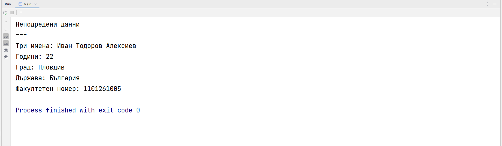
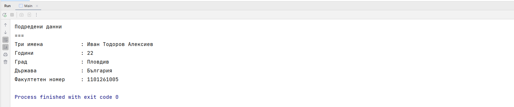
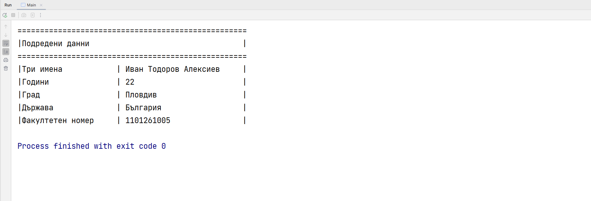
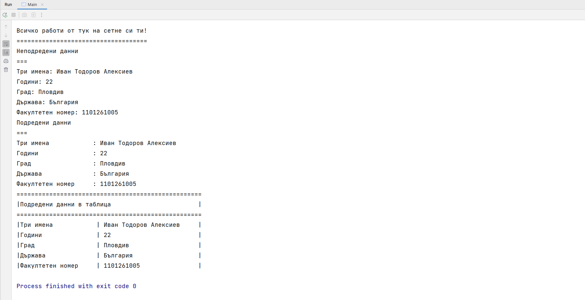

🟦 **Домашна работа 3**
# ЧатПатGPT

### 🚀 Въведение

Правителството на Замунда решило да създаде технологично бъдеще за своите поданици. Събрали 1 милион банани и разумно преценили да ги инвестират в дейности, подпомагащи ума, а не тялото. Съветът на стареишините се събрал под палмата и започнал стриктно да пресмята къде са иновациите. Едни настоявали да се направи втора ферма за банани, че първата не стигала. Други пък искали да организират мисия до Луната, понеже не може само с банани, трябва и сирене. А трети по-умни и по-наядени, отсекли, че видиш ли, ТРЯБВА да заменят естествения интелект с изкуствен такъв. Предложена била смела идея. Да се предоставят бананите на учени глави, за да създадът AI, който да превърне всички нули в Замунда, в единици. Речено сторено! Бананите били усвоени. Голямото откриване било съпроводено с бурни овации и развяване на байраци в очакване на интелекта да пропише код, но резултатът бил по-зле, отколкото на първокурсник в Замундския университет. 

Понеже президентът на Замунда имал роднини в Пловдив, бързо се обадили на специалисти от местната образователна институция, да ударят едно рамно в опитите да излекуват скъпата машина. Помогнете на изстрадалия замундски народ да внесе ред в дигиталния си хаус. 

### 💡 Изисквания към заданието

Получавате бележка от института по замундски науки и ремонти. Преди да започнете работа по заданието **прочетете от началото до края**. Ако не го сторите, може горчиво да съжалявате и да загубите време. Направете си стратегия, как ще подходите към проекта. Това е изкуствен интелект и той може да се бори само от естествен такъв. 

Приготвили сме ви едно хранилище, което съдържа злощастно генериран проект от ЧатПатGPT платформата. 

> https://git.fmi.uni-plovdiv.bg/java-1/23-24/chat-pat-gpt-start-project

Първата ни задача е да **КЛОНИРАМЕ** хранилището на нашите локални машини. **Програмата не работи и няма да се компилира**. Променете програмата (**БЕЗ ДА ИЗТРИВАТЕ СЪЩЕСТВУВАЩ КОД**), като добавите нови важни компоненти към програмата и разместите съществуващите линии код, така че да получите следния резултат изписан на конзолата. 

> Всичко работи от тук на сетне си ти! 
> ====================================

Ако сте видели горното съобщение, значи сме в добри ръце. Можем да се опитаме да ремонтираме изкуствения интелект в целия му блясък.

В дебелите книги пише, че изкуствения интелект има нужда от информация за хората и техните особени характеристики. В същата програма добавете, необходимите програмни конструкции, така че на екрана да се изведе информация за вас. Напълно задължително е да се изведът следните данни (за вас самите):
- три имена
- години
- роден град
- държава
- факултетен номер

Допълнително, добавете и заглавие **Неподредени данни** последвано от разделител **===**

Примерен изход, който програмата може да визуализира е:

Изкуственият интелект на нашите замундски приятели не разпознава неподредена информация. Ще се наложи да използваме познанията си за табулиране на текст, така че нашата импровизирана табличка да придобие малко по-подредена (таблична) форма. Визуализирайте същата информация, но нека тя бъде напълно симетрична и подредена. Добавете заглавие **Подредени данни** последвано от разделител **===**.

Никога не е излишно да сме фанатично подредени. Нека да добавим допълнителна рамка около нашата таблица, така че да дадем на изкуствения ни интелект, достатъчно добра свобода да интерпретира написаното от нас. Добавете заглавие **Подредени данни в таблица** последвано от разделител **===**. Резултата трябва да прилича на следния изход. 

Крайния резултат от всичките ни премеждия можете да видите на следния примерен изход (придържайте се към формата, религиозно).

Създайте ново хранилище с название **pu-fmi-java-intro-w3**, в което качете вашата нова, поправена и подобрена версия на ChatPatGPT. Създайте един нов README.md файл, в който добавете три скрийншота от кода на вашето приложение. Ако се чудите как се добавят картинки към markdown файл проверете документацията, която е закачена към ресурсите, на упражнението. 

След решаването на всяка една от подточките, направете нов commit, в които да опишете прогреса по проекта си до момента. 

### ✅ Критерии за оценяване

<table>
  <tr>
   <td>
     <strong><em>Функционалност</em></strong>
   </td>
   <td>
     <strong><em>Точки</em></strong>
   </td>
  </tr>
  <tr>
   <td>Клонирате и адекватно поправяте проекта от хранилището, което ви предоставихме.</td>
   <td>15</td>
  </tr>
  <tr>
   <td>Изведете информация за вашата собствена личност, по начин показан в примерния изход</td>
   <td>15</td>
  </tr>
  <tr>
   <td>Форматирайте информацията за вашата собствена личност, по начин показан в примерния изход.</td>
   <td>20</td>
  </tr>
  <tr>
   <td>Създайте рамка върху информацията за вашата собствена личност, по начин показан в примерния изход.</td>
   <td>20</td>
  </tr>
  <tr>
   <td>Създаване на хранилище в което да съхраните крайния резултат.</td>
   <td>10</td>
  </tr>
  <tr>
   <td>Създаване на README.md файл съдържащ изображения, от прогреса по проекта.</td>
   <td>10</td>
  </tr>  
  <tr>
   <td>Направете всички необходими commits, отразяващи всяка една от частите от работата ви по проекта.</td>
   <td>общо 10 (по 2 точка на къмит)</td>
  </tr>    

  <tr>
   <td><strong><em>Общо (точки)</em></strong>
   </td>
   <td><strong><em>100</em></strong>
   </td>
  </tr>
</table>

### 🪅 Начин на предаване
Предайте линк към новосъздаденото от вас хранилище **pu-fmi-java-intro-w3** в Google Classroom на домашното.
