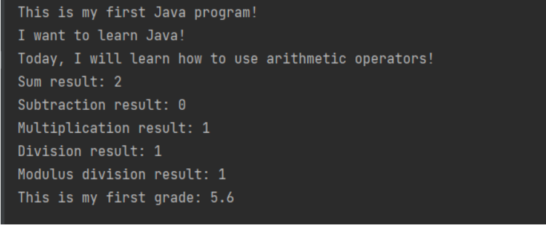
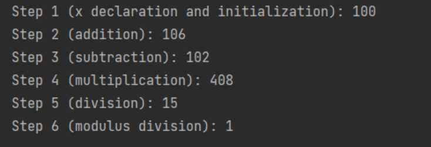
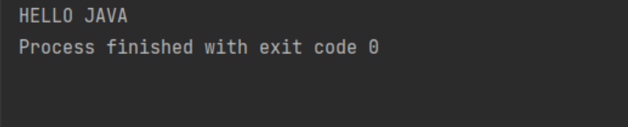

🟦 **Домашна работа 4**
# Проба Грешка

### 🚀 Въведение

Бай Иван не разбрал, че изкуственият интелект ще ни вземе работата и смело решил да се научи да програмира. В опита си да разцепи дигиталния мрак, той се записал в провитентна софтуерна академия и започнал да пуфти над тежките учебници и youtube видеа. 

Финалният изпит приближавал, а в главата се гонили само крави и кози. Бай Иван решил да се допита до услугите на професионални преписвачи и се свързал с местни студенти от елитни университети. Инвестирал в хонорара на майстори, купил си безжична слушалка, писалка и гумичка, и зачакал часа на истината. 

Помогнете на Бай Иван да сбъдне мечтите си.

### 💡 Изисквания към заданието

#### Задача 1
Поправете всички грешки в Java-кода по-долу, така че:
да се компилира и стартира успешно без никакви грешки в конзолата;
да се следва добрите практики и конвенции за именуване на класове, методи и променливи;
да извежда очаквания резултат в конзолата.

Java програма:

```java
public class task_one {

	public static void MAIN(String[] args) {
    	System.print("This is my first Java program!")

    	System.print("I want to learn Java!")

    	System.print("Today, I will learn how to use arithmetic operators!")

    	int Sum_Operation = 1 + 1
    	System.out.print("Sum result: " + Sum_Operation)

    	int SubtractionOperation = 1 - 1
    	System.print("Subtraction result: " + SubtractionOperation)

    	int multiplication_Operation = 1 * 1
    	System.print("Multiplication result: " + multiplicationOperation)

    	int Division_operation = 3 / 2
    	System.print("Division result: " + Division_operation)

    	int modulus_operation = 4 % 3
    	System.print("Modulus division result: " + modulus_operation)

    	float GRADE = 5.60
    	System.print("This is my first grade: " + GRADE)
	}
```
Очакван изход (резултат) в конзолата:



#### Задача 2
Използвайки комбинираните оператори за присвояване ("+=", "-=", "*=", "/=", "%="), реализирайте изрази, така че да удовлетворите условията на всяка една от стъпките по-долу. След всяка стъпка отпечатвайте резултата в конзолата.
- декларирайте променлива с наименование “x” и инициализирайте променливата “x” със стойност: 100
прибавете стойност “6” към текущата стойност на променливата “х” и присвоете резултата от операцията отново към променливата “х”
- извадете 4 от текущата стойност на променливата “х” и присвоете резултата от операцията отново към променливата “х”
- умножете по 4 текущата стойност на променливата “х” и присвоете резултата от операцията отново към променливата “х”
- разделете на 27 текущата стойност на променливата “х” и присвоете резултата от операцията отново към променливата “х”
- разделете на 7 текущата стойност на променливата “х” и присвоете остатъка от делението към променливата “х”

Очакван изход (резултат) в конзолата:




#### Задача 3
Отпечатайте фразата “HELLO JAVA” в конзолата, използвайки само и единствено примитивен тип “char” и Unicode представянето на буквите от латинската азбука. За всяка една от буквите, които са ви необходими за отпечатването на фразата, дефинирайте отделна променлива от тип “char”, която впоследствие използвайте за отпечатване в конзолата.

Очакван изход (резултат) в конзолата:


 

### ✅ Критерии за оценяване

<table>
  <tr>
   <td>
     <strong><em>Функционалност</em></strong>
   </td>
   <td>
     <strong><em>Точки</em></strong>
   </td>
  </tr>
  <tr>
   <td>Задача 1 се компилира и стартира успешно без никакви грешки в конзолата</td>
   <td>20</td>
  </tr>
  <tr>
   <td>Задача 1 следва добрите практики и конвенции за именуване на класове, методи и променливи</td>
   <td>15</td>
  </tr>
  <tr>
   <td>Задача 1 извежда очаквания резултат в конзолата</td>
   <td>15</td>
  </tr>
  <tr>
   <td>Използване на комбинираните оператори за присвояване в Задача 2</td>
   <td>10</td>
  </tr>
  <tr>
   <td>Коректни изчисления и постигане на очаквания резултат в Задача 2</td>
   <td>10</td>
  </tr>
  <tr>
   <td>Използване на Unicode представянето на буквите от латинската азбука за реализация на Задача 3</td>
   <td>20</td>
  </tr>  
  <tr>
   <td>Постигане на очаквания резултат в Задача 3</td>
   <td>10</td>
  </tr>    
  <tr>
   <td><strong><em>Общо (точки)</em></strong>
   </td>
   <td><strong><em>100</em></strong>
   </td>
  </tr>
</table>

### 🪅 Начин на предаване
Предайте линк към новосъздаденото от вас хранилище **pu-fmi-java-intro-w4** в Google Classroom на домашното.
