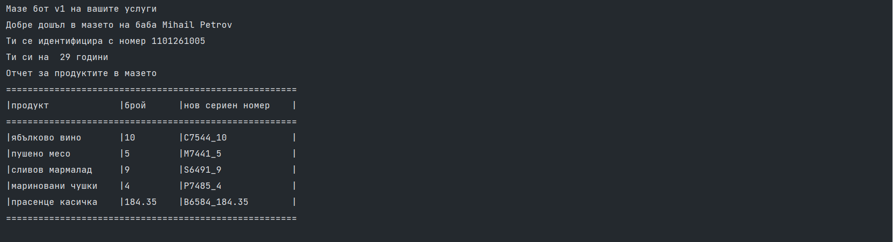

🟦 **домашна работа 5**
# Програмистко царство

## ВЪВЕДЕНИЕ

Драги ми HRко, какво чудо стана,
баба *C++олана* програмистка стана. Купи си компютър - вносен от битака. Цял ден се звери в LCD екрана, Windows моднат ползва с версия 12-та. 

Всичко тя за Java вече е прочела, пъшка и се вайка, дебъгва и нарежда. 
30 срещи в Zoom има ежедневно, кипри се кат' кукла слага грим на едро. Бабин дебеланко, кожа и кости стана - само се умилква, на баба *C++олана*, тя го не поглежда, учи класовете хванаха я вече баба бесовете. 

Един ден стана рано във зарана и ме с вик събуди баба *C++олана*. Слушай Програмисте, няма тъй да стане, двамата със тебе рефакторинг ще правим. Тия легасита, дружно да изхвърлим, че да може версията нова на Java-та да турим.Само hot фиксове в Stackoverflow намирам, copy-pastvam смело ама нищо не разбирам. 

Вчера стрина Гана в Skypе-a ме засече, гневно ме изгледа и ми се зарече. Цоцолано-Гано, накоди ли го вече, спринта мина - времето изтече. Пускай pull рикуеста, ще правим код ревю, ако не се стягай за ново интервю. Тюхкам се и вайкам, как да лъжа мажа, кат' цяла нощ експортвам Jar-ве в гаража.

Искам да намериш Java програмисти, ако трябва ще наемеш млади гимназисти. Тия симпатяги бързо събери ги на баба ти стара рамо да удариш.

Арно бабо арно викам, но се мръщя - цял банков модул имам да довършвам, но хващам се в ръки и тръгвам да оглеждам млади програмисти за баба да оДглеждам. Пълно е с таланти в интернета мрачен, пуснали CV-та да ти се доплаче, с по три сертификата, 20 летни стажа, само биткойни приемат обаче. Пенсията малка на баба ми се стори, няма тя парички за тия герои. После тъй отскочих до на Наков университета, пълно е обаче само със хлапета - искат кинти много, мрънкат постоянно, пишат некадърно - няма тъй да стане. 

Пак във Факултета ще диря аз спасение, ФМИ яви ми се като провидение. Чиста работа си викам даже далавера - първокурсници за баба от там ще намеря. Знаят все по нещо, търсят в интернета, без пари работят - тъй за авторитета. Опит трупат ценен, учат нови хватки, ох ще се побъркам с тия малки котки. 

Хванах за ушите 20 - 30 души, баба *C++олана* строго се намуси - под вежди изгледа младите юнаци и кат с нож отряза техните мераци. Слушай Програмисте, няма да сполучиш, тия малчугани трябва да обучиш. Спринта криво-ляво аз ще го оправя, но тия младежи си нямат и представа - как да пишат умно, как да търсят грешки, как да рънкат кода, по начин човешки. Хващайте се дружно и бегом в мазата, пълна е с компютри и буркани с зимнината. 

Искам да напишете програма функционална, да брои да смята, на баба бъднината. Ама кода искам да е красота, че да пишеш Java грозно си е грехота. Седмица ви давам да си майсторите, ако не работи ще дърпам ушите.

Тръгнах към мазата с моите програмисти, код да пишем дружно да се веселиме.

Поздрав най-сърдечен,  
твой приятел вечен burnout-нал Програмистчо

## СПЕЦИФИКАЦИЯ

Помогнете на баба C++олана да организира своята зимнина по подходящ начин, разполагате с набор от 10 задачи, които ще ви дадат насока за точните стъпки, които трябва да изпълните за да конструирате дигиталния помощник.

### **Задача 1**
При стартиране на програмата, е необходимо да се извежда съобщение, което да гласи:
> **Мазе бот v1 на Вашите услуги**
> 

### **Задача 2**
Баба *C++олана* е установила, че хората, които взимат буркани със зимнина, остават анонимни и по никакъв начин не се идентифицират. Затова изисва от вас да създадете подходящите променливи в които да съхраните вашите лични данни: 
- Първо име;
- Второ име;
- Уникален идентификатор;
- Възраст.

Баба *C++олана* знае, че вие сте студенти затова вашия уникален идентификатор ще бъде факултетния ви номер.

### **Задача 3**
След като получите информация за потребителя, изведете на екрана любезно съобщение, което да съдържа първото и второто име на потребителя: 
> **Добре дошъл в мазето на баба** *{Първо име}* *{Второ име}**
> 
> **Ти се идентифицира с номер** *{уникален идентификатор / факултетен номер}*
> 
> **Ти си на** *{възраст}* **години**

---

В мазето на баба *C++олана* е пълно с всякакви причудливи бурканчета, грижливо надписани и старателно подредени. Разполагате със стара тетрадка, в която са описани характеристиките на бабините провизии:

| артикул       | характеристика    |количество             |сигнатура на артикула  |
|---            |---                |---                    |---                    |
| ябълково      | вино              |10                     |C7544                  |
| пушено        | месо              |5                      |M7441                  |
| сливов        | мармалад          |9                      |S6491                  |
| мариновани    | чушки             |4                      |P7485                  |
| прасенце      | касичка           |184 лв и 35 стотинки   |B6584                  |

### **Задача 4**
Декларирайте променливи, които да съдържат името на характеристиката на всеки един от описаните в тетрадката продукти, като **низ**.
**Например**: ябълково вино.
**Внимание** името на променливата трябва да е напълно разбираема и да насочва потребителя към стойността. 

### **Задача 5**
Декларирайте променливи, които да съдържат количеството на всеки един от артикулите. 
*Имената на променливите трябва да са ясни и точни, така че дори и баба ви да ги разбере когато ги прочете.*

### **Задача 6**
Всеки един от описаните артикули разполага с уникален сериен номер. Серииния номер се състои от **сигнатурата на артикула** (описана в таблицата с артикулите) следвана от символа **_** и количеството на артикулите към момента.
*Пример:* Серииния номер на ябълковото вино би било **C7544_10**
Съхранете серийните номера за всеки един от артикулите, в променливи с подходящо название. 

### **Задача 7**
Всички въведени в програмата продукти трябва да могат да бъдат визуализирани под формата на табличка. 
Програмата извежда съобщение: 
> **Отчет за продуктите в мазето**
> 
След което в конзолата покажете табличка, съдържаща:
- името на продукта (колона - продукт)
- количеството на продукта (колона - брой)
- нов сериен номер (колона - нов сериен номер)

Табличката трябва да съдържа всички описани в старата тетрадка продукти, без изключение. 

## ПРИМЕРЕН ИЗХОД

Нека разгледаме примерен изход, който вашата програма може да прочете и изведе за потребителите на системата

## ЗАДАЧИ ЗА ИМПЛЕМЕНТАЦИЯ

Всяка една от разработените задачи ще се оценява в точкова система с арбитрарни тежести. Максималното количество точки, които можете да получите от решението на поставените ви условия е 100 точки.

Допълнително искаме да ви стимулираме, да правите по често къмити докато решавате ващите задачи така че за всеки къмит ще получавате по две точки, до максимум 10 точки. 

В рамките на първото упражнение, ще включим и дистрибутирането на вашето решение като част от крайната оценка. Повече информация за предаването на вашите решения можете да намерите в секция ПРЕДАВАНЕ НА РЕШЕНИЯТА.

| функционалност                | точки    |
|---                            |---       |
| Задача 1                      | 10       |
| Задача 2                      | 10       |
| Задача 3                      | 10       |
| Задача 4                      | 10       |
| Задача 5                      | 10       |
| Задача 6                      | 10       |
| Задача 7                      | 10       |
| Спазване на код конвенциите на Java | 10       |
| По 2 точки за всеки къмит | общо 10       |
| Качване на кода в GitLab      | 10       |

## ПРЕДАВАНЕ НА РЕШЕНИЯТА

Задължително е да си направите нов проект в GitLab-а на курса, със заглавие **pu-fmi-java-intro-w5**.