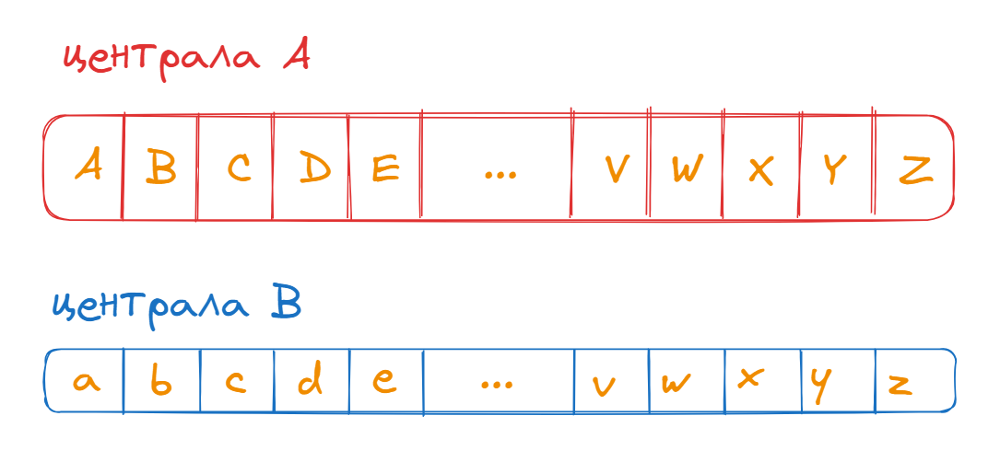
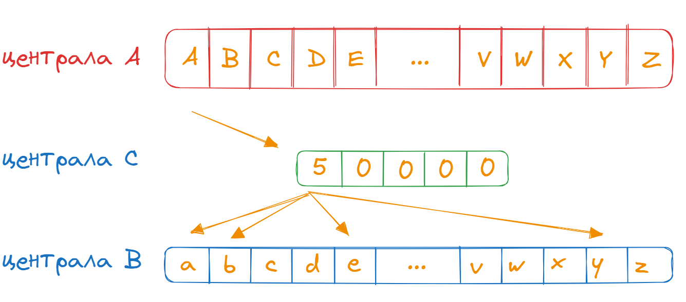

🟦 **домашна работа 11**
# Димни сигнали

## 🟥 Въведение

В селото на начетените джуджета, спечелили европейски проект за модернизация на комуникационната инфраструктура. Съвета на стареишините, се събрал да анализира как да разпредели бюджета мъдро. Заваляли предложения и абсурда станал неописуем. 

Синдиката на безработните джуджета искал да се направи охранителна система, за постоянен контрол на залежите от злато. Предложението било отхвърлено защото залежите отдавна били дадени на концесия и отписани при построяването на нов МОЛ.

Баба Джуджи държала да има възможност да гледа любимите си Елфски сериали, а не да чете за тях във вестниците. Но предложението за кабелна телевизия било отхвърлено защото никой в селото нямал все още телевизор.

Карали се, били се и пили докато накрая не решили - да прекарат телефонна централа от нашето до съседното село, като така решат наболелия проблем с липсата на клюки и обсъжданки. Проекта бил сложен и пипкав затова, с част от парите решили да направят банкет, на който да поканят видни програмисти от съседната махала. Говерело се че техния образователен ценз, можел да им стигне да разработят симулация, на телефонна централа, която да изпрати селото светлинни години напред в бъдещето.

## 🟦 Спецификация

Необходимо е да разработим симулация на телефонна централа.

Всяка една телефонна централа се състои от 26 телефонни кабинки номерирани с букви от латинската азбука:

- Централа A - е номерирана с буквите от **A** до **Z**
- Централа B - е номерирана с буквите от **a** до **z**

### Свързване между телефонни кабинки

За да се свържем с дадена кабинка използваме командата dial - като подаваме входящата и изходящата кабинка.

dial
A
a

Ако кабинките са свободни системата извежда скъобщение **CONNECTED** и разговора започва да се провежда. От този момент на сетне тази линия е със статус **ЗАЕТА**.

dial
A
a

**CONNECTED → [ Aa ]**

След като се състави нов разговор мрежата генерира **3 цифрен код**, който трябва да бъде **напълно уникален**.

При опит да се направи връзка към **ЗАЕТА** кабина, потребителя има възможност да избере една от две опции:

- да приеме входящия разговор и да затвори на текущия;
- да приеме входящия разговор и да паузира текущия;
- да игнорира входящия разговор.

Паузирания разговор се рапазва и може да бъде въстановен по всяко време. Един абонат може да паузира до 5 разговора в даден момент. 

**Пример**

- Костадин се обажда на Михаил
- Иван се обажда на Михаил - приемаме разговора паузираме Костадин
- Емо се обажда на Михали - приемаме разговора паузираме Иван
- Владо се обажда на Михаил - паузираме разговора с Емо
- Стоян се обажда на Михаил - паузираме разговора с Владо
- Георги се обажда на Михаил - паузираме разговора със Стоян
- Ангел се обажда на Михаил - системата не ни дава право да паузираме повече разговори. 

Или **ИГНОРИРАМЕ** разговора или **ЗАТВАРЯМЕ** на Георги. 

Всички абонати които са на пауза в момента могат да бъдат въстановени във всеки един момент, като изберем номера на паузирания разговор.

### Конферентни разговори

Иновативната ни централа поддържа възможност за вллючване на множество хора в конферентен разговор. 
Кабинката от която се обаждаме се нарича ДОМАКИН тои трябва да изброи всички кабинки на които иска да се обади с командата dial. 

Системата автоматично разбира че разговора е конферентен ако участниците са повече от 2 ма. 
Конферентните разговори се извършват с помоща на специална централа наречена **централа C**. Всеки конферентен разговор се съхранява в специален компютър за конферентни разговори, които се намира на територията на централата. Централата разполага с общо 5 компютъра, като всеки един от тях може да поддържа до 20 абона. 

Ако повече от 20 абоната се опитат да влязат в разговора то последния заема мястото на първия (особеност ДОМАКИНА влиза в бройката на абонатите но той се разглежда като нулев и никога не може да бъде изритан)

Разговора може да бъде прекратен само от ДОМАКИНА. 

Системата допуска и включване на абонати в **случаен конферентен** разговор, с помоща на командата **random**

Системата винаги избира  конферентен разговор с наи малка натовареност.

### Наблюдение на системата

Телефонната система се управлява от специалисти които постоянно извършват мониторинг върху линията. Те имат нужда от следните справки. 

- списък с всички заети мрежи
- списък с всички заети частни мрежи
- списък с всички заети конферентни мрежи

Информацията винаги трябва да се визуализира в следния формат:

**за часен разговор**
{ОБАЖДАЩ СЕ АБОНАТ } → {ПРИЕМАЩ АБОНАТ}

**за часен разговор с паузирани абонати**
{ОБАЖДАЩ СЕ АБОНАТ } → {ПРИЕМАЩ АБОНАТ} || {ПАУЗА АБОНАТ}, {ПАУЗА АБОНАТ}

**за конферентен разговор**
{ДОМАКИН} ↔ {АБОНАТ} <> {АБОНАТ} <> {АБОНАТ}

### Прекъсване на разговорите

Оператора може да прекъсне разговор като въведе кода на създадената мрежа. След прекъсване на разговора мрежата се рестартира незабавно.

### Тестване на системата

Предоставете скрииншоти с тестове, на отделните команди, които сте разписали. Там където не е изрично споменато, как да дефинирате командата добавете ваша собствена команда. 

## ✅ Критерии за оценяване

|                                                               |             |
| :-----------------------------------------------------------: | :---------: |
| **_Функционалност_**                                          | **_Точки_** |
| Логиката за свързване при частни разговори                    |      20     |
| Логиката за свързване при конферентни разговори               |      20     |
| Специфични правила при паузиране на разговори                 |      20     |
| Специфични правила при опит за връзка към препълнена мрежа    |      20     |
| Функционалност за случайно прикачване към конферентен разговор|      20     |

| Имплементация на всички функционалности за наблюдение         |      30     |
| Имплементация на функционалност за прекъснаве на разговорите  |      10     |

| Разписване на команди за тестване на системаа                 |      10     |
| **Общо (точки)**                                              |  **150**    |

## Предаване на решение

Задължително е да си направите нов проект в GitLab-а на курса, със заглавие **pu-fmi-java-intro-w12**