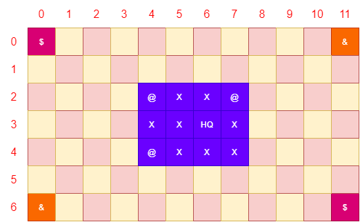
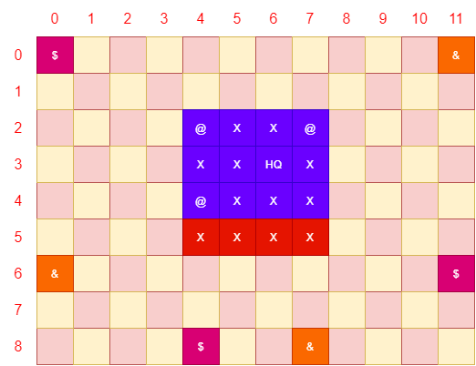
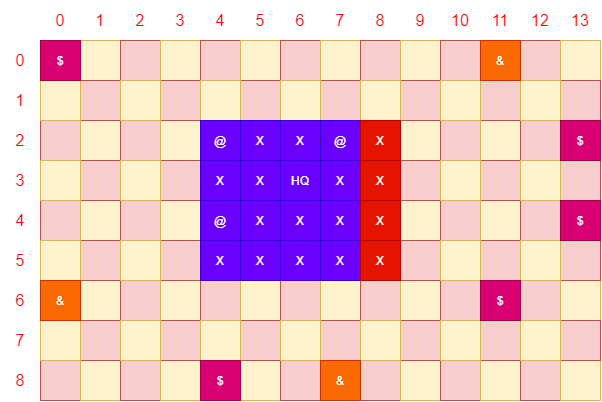
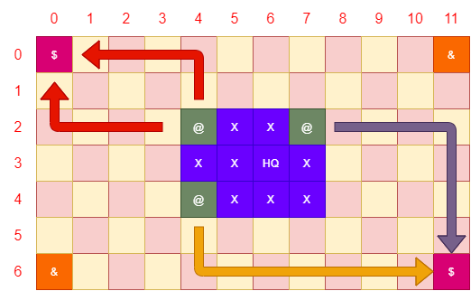

🟦 **домашна работа 13**
# Злите планове за превземане на Света, на малкото колибри Джибри и неговата банда от молци въздържатели

## Въведение

Злото никога не спи, особено когато го боли главата и шкембе чорбата отдавна е свършила.

Сред малките чаши и големите мечти се въргалял трупа на малкото колибри Джибри, не разбран зъл гении с трагична съдба. Още от малко пиле, Джибри имало голямо сърце, свързано с рядко генетично заболяване което го карало да прекарва дните си във фермата на своите доведени родители, отдавайки се на тежък физически труд и никаква признателност. Утеха, бъдещия злодей откривал във филмите на ужасите, които теглел незаконно от нерегламентирани пиратски сайтове, удобно локализирани в свободни икономически зони, в страната на трите обединени кралства и седемте разединени провинции. Електричеството било кът, единствения разумен способ за захранване на портативния CatPhone 99 бил малкия велоаргуметър на сестра му Бронхилда, която отдавна спряла да преследва инфлуенсърски статус и се отдала на модерни схващания за телесна красота и затлъстяване.

Кулминацията на този тъжен живот, дошла във фаталния ден в който младата и впечатлителна душа паднала в казана с Джибрите и от този ден на сетне, се родил злодея който всявал ужас в сърцата на производителите и дистрибутори на спиртни напитки. Воден от лични амбиции и душа черно като катран, един ден малкия злодей решил да измисли толкова зъл план, който да гарантира неговата тотална липса на трезвеност до края на дните му.

В технологичната си лаборатория, локализирана на самотен остров сред океана, малкото чудовище събрало своите последователи и разкрило стъпките си сред Урни ръкопляскания резултиращи в болки в главата и неприятен вкус в устата.

Ще откраднем целия спирт на света. Тропнало победоносно пилето с малките си крилца. Време е света да разбере за нашата мощ. Ще построим дървен мост до й-близките провинции и ще сложим ръка върху течното опиянение, което пази мирните граждани на целия свят от депресия и семейни скандали. След което ще завладеем света.

Втората част не е ясно как ще стане, също дали този план има някаква потенциална реализация на практика, но Вие сте шефа на тайната лаборатория на Джибри и сте ангажиран с управлението на цялата зла кампания.

Целта е проста и ясна, Джибри да **завладее света**

## Спецификация

Време е да завладеем света. Това е не лека задача, която ще изисква сериозни ресурси, пълна отдаденост и много много много пари. Така че нека да видим какъв имот откриха верните брокери на Сатаната за нашата зла база, която ще се превърне в новия дом на бъдещата империя на злото.

Кампанията за световна доминация, се разиграва върху правоъгълна решетка с размери **7 реда** и **12 колони**,. Но не се привързвайте към тази комфортна зона, няма да останем дълго тук.

На графиката с лилаво е отбелязан острова на свободата малката сладка базичка, която че подчини света на своята воля. Размерите му са стриктни, бюджета стигна за толкова. Три реда и четири колони разположени точно на посочените координати в южния Пасифик. Райско кътче, което ще отвори портите на Ада.

Както виждате, нашето островче е нашарено с различни символчета, и буквички, които ви съветваме да игнорирате на този етап. Ще получите всички необходими обяснения, когато му дойде времето.

Около нашето прекрасно парче, вулканична твърдина, са разположени малки и безобидни парчета земя, които веднага се превръщат в кандидати за нашите търговски апетити или бъдещи роби на желязната ни ръка.

Символите зад тях, също крият малки тайни, които ще разкрием пред вас, скоро.

## ЕКСПАНЗИЯ

Няма да крием че световната доминация изисква мащаби. Трябва ни евентуално още територия за гигантските ни оръжия, склад за милионите които ще откраднем ииии много много други подобни такива.

В рамките на кампанията за световна доминация имаме възможност да разширим два пъти нашата империя. Всяко едно разширение увеличава територията на нашата база с един ред и ни дава информация за нови островни държави които са готови да се присъединят към великото ни дело.

### Експанзия 1 (пътят към злата монархия)

-   Необходим бюджет за постигане на експанзията **10 000 парички**
-   **Добавя допълнителен един ред към базата.**
-   Добавя един нов слот за постояване на пристанище на произволно място. (на картата е отбелязано със символ **[X] върху червен ред**)
-   Разкрива позицията на нови острови по картата
-   Дава възможност за построяване на нови сгради тип **Експанзия 1**

****

### Експанзия 2 ( ИМперията на злото )

-   Необходим бюджет за постигане на експанзията **50 000 парички**
-   **Добавя допълнителен един ред към базата.**
-   Добавя един нов слот за постояване на пристанище на произволно място. (на картата е отбелязано със символ **[X] върху червена колона**)
-   Разкрива позицията на нови острови по картата
-   Дава възможност за построяване на нови сгради тип **Експанзия 2**

****

## СГРАДИ

Сградите са основните ви източници на средства в злите ви дела. Можете да построите колкото си искате сгради от един и същи вид (**ако има смисъл де**). Някой сгради ви дават възможност да достъпите **допълнителни възможности на играта (например пристанището, ви отключва ИКОНОМИКАТА), докато други ви носят пасивен дивидент на база всеки ход.**

Всяка сграда се описва с няколко характеристики, които са представени в табличка, съдържаща тяхното описание. Името на базата е начина по който ще комуникираме в спецификацията какво ще построим и как то ще се отрази на бъдещите ни пъклени планове. **А съкращението й е начина по който ще се визуализира на картата.**

Всяка сграда си има разходи за строителство, които са необходими за да можете да присъедините новата постройка към злата си империя. До бюджета също така е изписан и срока във ходове които е необходим за да може една сграда да влезе в експлоатация. Срока започва да се брои от следващия ход, на играча. За да постоите сграда трябва да изберете координати, които в момента са не заети от съществуваща такава. Докато сградата е в процес на строителство върху картата тя е отбелязана със символа [!]

**ПРИМЕР**
Ако сградата има необходими **2 хода за строителство**, и вие се намирате на ход 10 в момента в който дадете разрешение за постояването и то на ход 13 сградата ще бъде в експлоатация. Всички ефекти, приходи и разходи се отчитат само в ходовете в които сградата функционира.

Функционирането на всяка сграда носи със себе си модификатори на цялостната икономика на вашата мисия. Всеки един модификатор е отразен в таблица със следните кратки наименования:

-   генерира – това са парите които получавате **всеки ход** от това че сградата функционира
-   харчи – това са разходите за поддръжка на сградата в рамките на **всеки ход**
-   одобрение **–** увеличава еднократно народното одобрение
-   недоволство**–** увеличава еднократна народното недоволство

Допълнително всяка една сграда може да съдържа описание, което описва какви са придобивки които носи нейното построяване. Всички сгради са описани под формата на таблица. 

| **{ИМЕ НА СГРАДАТА} [{СЪКРАЩЕНИЕ}]**  | **{ЦЕНА ЗА СТРОИТЕЛСТВО} / {СРОК В ХОДОВЕ}** |           |             |
|---------------------------------------|----------------------------------------------|-----------|-------------|
| генерира                              | харчи                                        | одобрение | недоволство |
| {СУМА ПАРИЧКИ}                        | {ЧИСЛО}                                      | {ЧИСЛО}   | {ЧИСЛО}     |

### СГРАДИ – ОСНОВНИ

За да завладеете света е необходимо да имате достатъчно ресурси, да отгледате зли подчинени и да. Разполагате с възможност да построите следните сгради.

| **ЗЛА БАЗА [HQ]** | **получаваме я наготово** |           |              |
|-------------------|---------------------------|-----------|--------------|
| генерира          | харчи                     | одобрение | недоволство  |
| 0                 | 1000                      | нищо      | нищо         |

| **ЛАБОРАТОРИЯ [LB]**                                                                                                                      | **1000/1** |           |             |
|-------------------------------------------------------------------------------------------------------------------------------------------|------------|-----------|-------------|
| генерира                                                                                                                                  | харчи      | одобрение | недоволство |
| 0                                                                                                                                         | 1000       | 5         | 0           |
| Лабораторията е задължителна за отключването на следващия етап от завладяването на света. Постояването и ви отключва менюто **Зъл План.** |            |           |             |

| **ПРИСТАНИЩЕ [P]**                                                                                                                 | **1000/1** |           |             |
|------------------------------------------------------------------------------------------------------------------------------------|------------|-----------|-------------|
| генерира                                                                                                                           | харчи      | одобрение | недоволство |
| 0                                                                                                                                  | 1000       | 5         | 0           |
| Пристанището е задължителна сграда за отключването на меню **ИКОНОМИКА**. Ако искате да не умрете от глад действайте експедитивно. |            |           |             |

### СГРАДИ – ЕКСПАНЗИЯ 1 (МОНАРХИЯ НА ЗЛОТО)

Първата ни експанзия ни носи скици и чертежи за построяването на удобни сгради на военния прогрес и образованието.

| **КАЗАРМА [B]**                                                                                                                                           | **1000 / 1** |           |             |
|-----------------------------------------------------------------------------------------------------------------------------------------------------------|--------------|-----------|-------------|
| генерира                                                                                                                                                  | харчи        | одобрение | недоволство |
| 0                                                                                                                                                         | 1000         | 0         | 1           |
| Дава възможност за активиране на акциите **ОТВЛИЧАНЕ** и **КРАЖБА. Всяка казарма която построите трябва да може да се специализира при построяването й.** |              |           |             |

| **УНИВЕРСИТЕТ [U]**                           | **1000 / 1** |           |             |
|-----------------------------------------------|--------------|-----------|-------------|
| генерира                                      | харчи        | одобрение | недоволство |
| 500                                           | 1000         | 10        | 0           |
| Отключва менюто **НАУЧНО ТЕХНИЧЕСКИ ПРОГРЕС** |              |           |             |

| **ДАНЪЧНИ [RA]**                                                                                                                            | **1000 / 1** |           |             |
|---------------------------------------------------------------------------------------------------------------------------------------------|--------------|-----------|-------------|
| генерира                                                                                                                                    | харчи        | одобрение | недоволство |
| 1000                                                                                                                                        | 500          | 0         | 5           |
| Сградата се грижи за редовно събиране на данъчни от вашите верни подчинени. Също така активира акцията **ВЗИМАНЕ НА КРЕДИТ ОТ ЗЛАТА БАНКА** |              |           |             |

### СГРАДИ – ЕКСПАНЗИЯ 2 (ИМПЕРИЯ НА ЗЛОТО)

Нито една империя на злото не може да съществува без култура. И понеже всички зли учени са възпитани и имат завидно високо ниво на обноски и поведение, втората експанзия носи със себе си само и единствено продукти на интелектуалния копнеж и висока изисканост.

| **ТЕАТЪР [T]**                                                                         | **1000 / 2** |           |             |
|----------------------------------------------------------------------------------------|--------------|-----------|-------------|
| генерира                                                                               | харчи        | одобрение | недоволство |
| 0                                                                                      | 100          | 5         | 0           |
| Сграда за забавление и релакс грижи се за цялостното удовлетворение на вашите поданици |              |           |             |

| **МЕДИИ [M]**                                                                                                                                                                            | **1000 / 2** |           |             |
|------------------------------------------------------------------------------------------------------------------------------------------------------------------------------------------|--------------|-----------|-------------|
| генерира                                                                                                                                                                                 | харчи        | одобрение | недоволство |
| 0                                                                                                                                                                                        | 500          | 5         | 0           |
| Диктатурата изисква твърда ръка, на острова на свободата има много вестници но само едно мнение, разбира се вашето. Медиите са готови да потушат всякакъв конфликт и проблемни ситуации. |              |           |             |

| **ХРАМ [T]**                                                                                                                                                                                            | **1000 / 2** |           |             |
|---------------------------------------------------------------------------------------------------------------------------------------------------------------------------------------------------------|--------------|-----------|-------------|
| генерира                                                                                                                                                                                                | харчи        | одобрение | недоволство |
| 0                                                                                                                                                                                                       | 100          | 5         | 0           |
| Великия диктатор е като живото въплъщение на самия Бог, какво по добро място да се свържеш със съзнанието на твоя лидер, от храма. Сградата намалява всякакво недоволство с 1 единица на всеки 5 хода.  |              |           |             |

## ХАРАКТЕРИСТИКИ НА ОСТРОВА НА СВОБОДАТА

Няма как да изневерим на злия си имидж избрахме си остров, като от сън, само че не от нашия а от този на Стивън Кинг, Мерилин Менсън и Джорджано в едно. Когато строим върху него ще трябва да се съобразим с няколко характеристики.

Основната ни база **HQ се позиционира на произволно място в началото на играта. Всички останали терени могат да се дефинират като [X] празни строителни площадки и [@] заливи.**

****

**Имате възможност да строите всякакви сгради върху пространствата дефинирани с [X]. Веднъж построена една сграда не може да бъде унищожавана, затова преценете внимателна с каква площ разполагате.**

**Пристанищата са ограничен брой могат да бъдат построени само върху заливи, които са отбелязани с [@].**

| **ВАЖНО** | По време на експанзиите на ваши остров, успявате да намерите неизследвана територия, **която може да бъде облагородена за нуждите на търговските ви интереси**.  След всяка експанзия **имате право** да създадете едно ново пристанище, в рамките **на едно произволно празно пространство избора е ваш.** |
|-----------|-------------------------------------------------------------------------------------------------------------------------------------------------------------------------------------------------------------------------------------------------------------------------------------------------------------|

## ИКОНОМИКА

Икономиката е основния механизъм за генериране за справяне с капиталистическите очаквания на обществото. Не забравяйте че трябва да обгрижвате и глезите злите си подчинени, като не забравяте че имате да издържате цяла зла планова икономика, която разчита на магията на конвенционалната валута.

Икономиката е достъпна в момента в който отключите вашето пристанище. Тя ви дава възможност да извършите едно от следните действия :

-   Да построите търговски коридор
-   Да взимате кредити от чужди банки и финансови институции
-   Да крадете и отвличате.

### СТРОИТЕЛСТВО НА ТЪРГОВСКИ КОРИДОР

Това е най-сигурния начин да си докарвате свежи капитали на месечна база. За да построите търговски коридор е необходимо да имате **свободно пристанище**. **Всяко пристанище гарантира** **само един търговски коридор**. Търговски отношения можете да осъществите само и единствено с острови които са отбелязани като търговски **[\$].**

**За да подпишете договор гарантиращ бъдещи финансови постъпления е необходимо ръчно да навигирате вашите плавателни съдове до най-близките ви търговски партньори. Навигацията се осъществява с координатите на световната карта, а в ролята на смелия капитан влизате вие. В момента в който търговска сделка бъде парафирана, корабите ви ще знаят терена и ще се придвижват самостоятелно, в рамките на всеки ход.**

Имате право да се придвижвате само и единствено по стените на съседни квадрати движението по диагонал е забранено (освен ако съответен научен технически прогрес не е влязъл в сила).

В рамките на един ход, кораб може да се придвижи само и единствено в рамките на едно квадратче. (освен ако съответен научен технически прогрес не е влязъл в сила).

Търговско отношение се осъществява когато кораба стъпи върху квадратчето на острова с който цели да организира бъдещата си търговия.

| **ПРИМЕР** | На графиката сме показали **различни варианти за придвижване до острови,** на които е установено че имат парични ресурси. Пътя който ще трябва да изберете зависи само и единствено от вас. Можете да се изживявате като морски вълк и да пътувате из океаните безконечно, в търсене на скрито съкровище и извора на младостта или да се опитате да откриете най краткия път и да вкарате малко свежи пари в икономиката на злата ви държава.   Най краткия маршрут от пристанище с координати [2,4] e през координати [2,3] към [2,2] към [2,1] към [2, 0] към [1,0] към [0,0] което прави точно 6 хора за придвижване.  |
|------------|---------------------------------------------------------------------------------------------------------------------------------------------------------------------------------------------------------------------------------------------------------------------------------------------------------------------------------------------------------------------------------------------------------------------------------------------------------------------------------------------------------------------------------------------------------------------------------------------------------------------------|

Всяка сключена търговска сделка ви носи сума от **10** **000 парички**, при успешното завръщане на кораба на вашето пристанище.

| **ВАЖНО** | Маршрута който сте избрали за да достигнете до острова, ще бъде следван в обратна посока, при завръщането на кораба в пристанището. **Това е важно защото във всеки един момент ще имате възможност да наблюдавате всичките си кораби по картата, в рамките на даден ход**. За това ви свойство като диктатор, ще стане ясно малко по късно.  |
|-----------|-----------------------------------------------------------------------------------------------------------------------------------------------------------------------------------------------------------------------------------------------------------------------------------------------------------------------------------------------|

Във всеки един момент можете да стопирате активни търговски взаимоотношение и да стартирате нови. Сега ще си кажете защо това е необходимо. Ами ако например успеете да активирате подобрения по вашата флотилия която ви дава възможност да се придвижвате по-бързо по картата, тогава е необходимо да активирате нова мисия.

Корабите, които се намират върху световната карта се отбелязват със символа [**\#]**

### КРАЖБА И ОТВЛИЧАНЕ

За да активирате тази си функция е необходимо да разполагате със свободна казарма. Всяка казарма може да се специализира или само в кражба или само във отвличане. Ето ги и характеристиките на тези две активности :

-   Кражбата носи **месечен приход** от **500 парички**
-   Отвличането носи **месечен приход** от **1500 парички** но на всеки **6 хода увеличава** недоволството на поданиците ви с **5 единици**

За да активирате някое от двете действия е необходимо да посочите координатите на остров който е притегателно място за туристическа индустрия, те са отбелязани със символа [**&**]. Един остров може да бъде ползван само и единствено за едно от двете начинания.

### ВЗИМАНЕ НА КРЕДИТ ОТ ЗЛАТА БАНКА

Гигантски лазер 100 000 парички, стая за мъчения 50 000 парички, да чуеш виковете и агонията на своите врагове безценно, има неща които парите не могат да купят, за всичко останало си има Зла Банка.

Понякога ножа опира до кокала и трябва да клекнем пред по-заможните от нас. Кредитите на най-злата финансова институция могат да бъдат взети еднократно. Съществуват следните опции.

| **кредит**                      | **сума** | **срок на връщане** |
|---------------------------------|----------|---------------------|
| Кредит зъл стартъп              | 10 000   | 12 хода             |
| **Кредит злодей**               | 50 000   | 24 хода             |
| Кредитна програма доктор Злобил | 100 000  | 36 хода             |

Лихвата за всички кредити е 10 процента и трябва да бъде върната в края на срока за връщане. Дори да се опитате да върнете по рано паричките, sorry отново дължите същата лихва.

| **ПРИМЕР** | Ако вземете кредит от 10 000 парички до 12 хода трябва да върнете 11 000, без значение кога решите да го сторите. |
|------------|-------------------------------------------------------------------------------------------------------------------|

## НАУЧНО ТЕХНИЧЕСКИ ПРОГРЕС

ИНдустрията на злото винаги може да предложи гъвкави и бъджетни решения за постоянен терор и ефективна рационализация на усилията ни. Нашия екип от амбициозни ЗЛИ учени стажанти, са готови да ви предложат средства за справяне с всеки проблем.

Всяко едно подобрение се характеризира със:

-   сума която трябва да бъде заделена за да се направи проучването
-   количество ходове необходими за да се направи проучването. Ходовете започват да текът от следващия игрови ход.

| **ПРИМЕР** | Ако в рамките на **ход 10** изберете да направите проучване за подобрение**, което отнема 2 хода то ход 11 и ход 12** ще бъдат заети от проучването а резултатите ще бъдат валидни от началото на **ход 13** |
|------------|--------------------------------------------------------------------------------------------------------------------------------------------------------------------------------------------------------------|

Имате възможност да активирате следните подобрения в рамките на острова на свободата.

### Търговски подобрения

| **подобрение**                                                                                                           | **сума** | **срок на проучване** |
|--------------------------------------------------------------------------------------------------------------------------|----------|-----------------------|
| Двигател тайфун                                                                                                          | 2 000    | 2 хода                |
| Дава възможност на всичките ви кораби да се придвижват два пъти по бързо по картата, като преминават по две квадратчета  |          |                       |
| Диагонална струя                                                                                                         | 3000     | 1 ход                 |
| Дава възможност на всичките ви кораби да се придвижват по диагонал                                                       |          |                       |

### СОЦИАЛНИ ПОДОБРЕНИЯ

| **подобрение**                                                               | **сума** | **срок на проучване** |
|------------------------------------------------------------------------------|----------|-----------------------|
| Умни тоалетни                                                                | 5 00     | 1 хода                |
| Увеличава удовлетворението от вашата н\*на политика с 1 единица всеки 4 хода |          |                       |
| Ефективни данъци                                                             | 3000     | 2 хода                |
| Намалява негативния ефект от събирането на данъците с 50%                    |          |                       |

## ЗЪЛ ПЛАН

Всеки зъл гении трябва да си има план в живота. В рамките на вашето приключение можете да измислите и активирате зъл план който да постави света на колене. Понеже това хоби е екстремно скъпо, в даден момент имате възможност да развивате само един единствен проект за осъществяване на световна доминация.

Активирането на зъл план не е необходимо за да приключите играта успешно. Много преди вас са пробвали и са се провалите винаги можете да си запазите правото да напълните гащите и да се отдадете на тирания и локална злоупотреба с господстващо поведение.

За да активирате зъл план е необходимо да са налице следните обстоятелства :

-   Необходимо е да имате установени поне 2 търговски връзки с чужди острови
-   Необходимо е да се активирали поне една акция по **отвличане**
-   Необходимо е да сте активирали поне една акция по **кражба**
-   Необходимо е рейтинга ви на народно одобрение да е поне 40%

В момента в който активирате злия ви план, вие автоматично инвестирате **10 000 парички** в неговото изпълнение. Злия план се изпълнява в рамките на **16 хода** и всеки ход гълта по **1 000 парички**. Ако в даден момент парите свършат плана пропада и всичко което сте инвестирали се превръща в артефакт от вашето минало.

Разбира се, че имате възможност отново да направите опит за световно господство още в рамките на следващия ход. Организацията на чудовищата и злодеите вярва, че само постоянството може да донесе успех на един зъл гении.

Ако плана ви успешно се осъществи. Честито, потупайте се по рамото света е вече ваш, вие наследихте проблемите на безпирната инфлация, крипто валути със съмнителни животински имена, глобално затопляне, световен глад, безкрайна война, липса на расова толерантност, тотална липса на уважение, неизмерима токсичност в социалните мрежи и още много такива. Да ви е честит новия Свят, управлявайте го мъдро.

## ПОЛИТИЧЕСКИ РЕЖИМ И НАРОД

Какво е злия гении без неговите верни поданици. Винаги готови да скочат срещу враговете ви, да поемат куршум със зъби или просто да успокоят угрижената ви душа. Ваше право е да ги ползвате и ваше задължение да ги направлявате. Но народната любов е крехък актив, може да бъде потрошена много лесно. Малкото общество което управлявате разполага с един показател, които постоянно се люшка между скалата **от 1 до 100** и това е **НАРОДНОТО ОДОБРЕНИЕ**.

Започвате играта със 100 единици одобрение. Това е максималната горна граница която можете да постигнете. По време на вашата тиранична диктатура, ще правите избори които ще намаляват, вашето влияние върху обществото, като в един момент ще трябва да се изправите пред тест за вашата мъдра лидерска особа. Острова на свободата се управлява с твърда ръка, но е задължително да се вслушваме в гласовете на хората. Често тяхното недоволство се преплита с възгласите на 100% одобрение и безкрайна любов.

**Всяка година във вашата малка поднебесна империя се провеждат избори**. Ако те не ви донесат необходимия, електорален капитал, дните ви като върховен вожд са преброени. Изборите се провеждат автоматично **след приключване на 12 хода**. Следете процентите си и бъдете осторожен, година невнимание и после цял живот безработен диктатор.

| **ВАЖНО** | За да не паднете от власт е необходимо да държите 40% от народната любов. Каквото е изискването за активиране на злия ви план. |
|-----------|--------------------------------------------------------------------------------------------------------------------------------|

За да наклоните везните във ваша полза е необходимо да инвестирате усилията си в строене на сгради които да подпомагат задоволството на населението, да балансирате монетарната си политика или да инвестирате периодично във кампании които да тушират напрежението. Няма да ви казваме как да си вършите работата, само внимавайте да не поемете по пътя на Румънският си предшественик и всичките ви надежди за светло бъдеще да увиснат така да се каже 😊

## ИГРОВИ ЦИКЪЛ И ИЗИСКВАНИЯ КЪМ ИНТЕРФЕЙСА

Вашата кампания за завладяване на света се провежда на така наречените ходове. Всеки ход е условно дефиниран като действие **с продължителност един месец**. Изхвърлете реализма през прозореца, тук се опитваме да създадем един по добър нов свят.

### В началото на всеки ход

Получавате всички суми и парични постъпления, които са ви обещани в зависимост от действията, които сте направили в предишните ходове.

Губите всички парични единици, които се събират от активности с продължителен период на изпълнение. Например активиран вече **Зъл план.**

### СЛЕД ТОВА СТЕ ВИЕ

В рамките на един ход имате право да направите по едно от следните действия :

-   Да навигирате търговски кораб в рамките на световната карта, (ако това е първата му експедиция)
-   Да вземете кредит
-   Да направите проучване
-   Да активирате зъл план

В рамките на един ход имате право да направите следните действия по повече от веднъж

-   Да построите сграда (щом имате парички действайте)

| **ВАЖНО** | Не забравяйте че има действия които могат да се направят само по веднъж докато срока им на експлоатация не приключи. Например можете да активирате **зъл план, само веднъж докато тече срока в който плана се изпълнява.**  |
|-----------|-----------------------------------------------------------------------------------------------------------------------------------------------------------------------------------------------------------------------------|

### ИНТЕРФЕЙСА НА ВАШАТА ЗЛА ОПЕРАЦИЯ

Трябва да включва всички описани възможности, като не забравяйте че не всички възможности са достъпни от самото начало, необходимо е да имаме налице определени бази или обстоятелства за да активираме, текущия си потенциял.

В началото на всеки ход е необходимо да се изчертава световна карта, която да включва:

-   Всички бази които са построени
-   Всички незаети празни територии (отбелязани със съответните символи)
-   Всички движещи се търговски кораби, които са поели на пътешествие или се връщат от него.

## НАЧАЛО И КРАЙ НА ИГРАТА

Играта започва с бюджет **от 10 000 парички**

Тази игра няма край, това е вашия живот. Никой не излиза от властта по друг начин освен с краката напред. Но всеки уважаващ себе си диктатор си има някаква граница и затова ще се опитаме да дефинираме и такава за вас.

### Играта приключва успешно в момента, в който:

-   когато успеете да съберете в диктаторската касичка 1 000 000 или повече парички.
-   когато, успеете да се задържите на пост повече от 5 години без народната любов да ви скъса задника от целувки
-   успеете да осъществите злия си план

### Играта приключва ТРАГИЧНО в момента, в който:

-   не успеете да си върнете кредита към Злата Банка
-   паднете от власт

## ✅ Критерии за оценяване

| **Функционалност**                                | **Точки** |
|---------------------------------------------------|-----------|
| Визуализация на картата с всички коректни символи | 5         |
| Реализация на експанзия 1                         | 10        |
| Реализация на експанзия 2                         | 10        |
| Реализация на всички основни сгради               | 10        |
| Реализация на всички сгради тип експанзия 1       | 10        |
| Реализация на всички сгради тип експанзия 2       | 10        |
| Реализация на Икономика тип търговия              | 10        |
| Реализация на Икономика тип отвличане             | 10        |
| Реализация на Икономика тип кражба                | 15        |
| Реализация на Икономика тип взимане на кредит     | 15        |
| Реализация на научно технически прогрес           | 15        |
| Реализация на ефекти от търговски подобрения      | 15        |
| Реализация на ефекти от социални подобрения       | 15        |
| Реализация на годишни избори                      | 15        |
| Реализация на игрови цикъл                        | 15        |
| Реализация на подходящ игрови интерфейс           | 15        |
| Реализация на края на играта                      | 15        |

## Предаване на решение

Задължително е да си направите нов проект в GitLab-а на курса, със заглавие **pu-fmi-java-intro-w13**